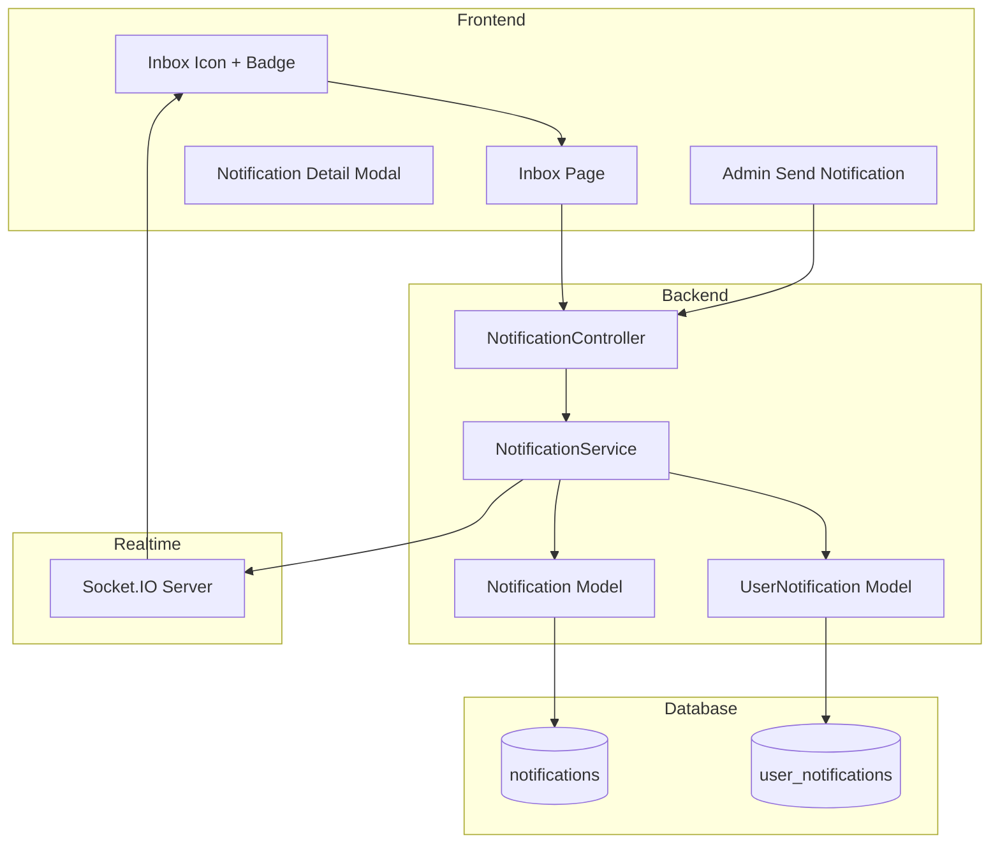

# Design Document: Admin Notification Inbox

## Overview

Hệ thống thông báo từ Admin cho phép quản trị viên gửi thông báo đến người dùng thông qua hộp thư (inbox). Hệ thống hỗ trợ gửi thông báo cá nhân và broadcast, với khả năng theo dõi trạng thái đọc và quản lý thông báo.

## Architecture



## Components and Interfaces

### Backend Components

#### NotificationService Interface
```php
interface NotificationServiceInterface
{
    // Tạo thông báo mới
    public function create(string $adminId, string $title, string $content, array $recipientIds, bool $isBroadcast): NotificationResult;
    
    // Lấy inbox của user
    public function getInbox(string $userId, int $page, int $limit): array;
    
    // Lấy chi tiết thông báo
    public function getNotification(string $userId, string $notificationId): ?array;
    
    // Đánh dấu đã đọc
    public function markAsRead(string $userId, string $notificationId): bool;
    
    // Đánh dấu tất cả đã đọc
    public function markAllAsRead(string $userId): int;
    
    // Xóa thông báo (user)
    public function deleteForUser(string $userId, string $notificationId): bool;
    
    // Xóa thông báo (admin - cascade)
    public function deleteByAdmin(string $adminId, string $notificationId): bool;
    
    // Lấy số lượng chưa đọc
    public function getUnreadCount(string $userId): int;
    
    // Lấy danh sách đã gửi (admin)
    public function getSentNotifications(string $adminId, int $page, int $limit): array;
    
    // Lấy thống kê đọc
    public function getReadStats(string $notificationId): array;
}
```

#### NotificationController
```php
class NotificationController
{
    // POST /api/notifications - Admin gửi thông báo
    public function send(Request $request): Response;
    
    // GET /api/notifications/inbox - User lấy inbox
    public function inbox(Request $request): Response;
    
    // GET /api/notifications/{id} - Lấy chi tiết
    public function show(string $id): Response;
    
    // POST /api/notifications/{id}/read - Đánh dấu đã đọc
    public function markRead(string $id): Response;
    
    // POST /api/notifications/read-all - Đánh dấu tất cả đã đọc
    public function markAllRead(): Response;
    
    // DELETE /api/notifications/{id} - Xóa thông báo
    public function delete(string $id): Response;
    
    // GET /api/notifications/unread-count - Lấy số chưa đọc
    public function unreadCount(): Response;
    
    // GET /api/admin/notifications/sent - Admin xem đã gửi
    public function sent(Request $request): Response;
    
    // DELETE /api/admin/notifications/{id} - Admin xóa broadcast
    public function adminDelete(string $id): Response;
}
```

### Frontend Components

#### InboxIcon Component
- Hiển thị icon hộp thư với badge số thông báo chưa đọc
- Subscribe realtime updates qua socket

#### InboxPage Component
- Danh sách thông báo với pagination
- Filter: All / Unread
- Actions: Mark as read, Delete, Mark all as read

#### NotificationDetailModal Component
- Hiển thị nội dung đầy đủ của thông báo
- Auto mark as read khi mở

#### AdminNotificationPage Component
- Form gửi thông báo: title, content
- Chọn recipients: All users / Specific users
- User search/select component
- Danh sách thông báo đã gửi với stats

## Data Models

### notifications table
```sql
CREATE TABLE notifications (
    id UUID PRIMARY KEY DEFAULT gen_random_uuid(),
    admin_id UUID NOT NULL REFERENCES profiles(id),
    title VARCHAR(255) NOT NULL,
    content TEXT NOT NULL,
    is_broadcast BOOLEAN DEFAULT FALSE,
    created_at TIMESTAMPTZ DEFAULT NOW(),
    deleted_at TIMESTAMPTZ NULL
);
```

### user_notifications table
```sql
CREATE TABLE user_notifications (
    id UUID PRIMARY KEY DEFAULT gen_random_uuid(),
    notification_id UUID NOT NULL REFERENCES notifications(id) ON DELETE CASCADE,
    user_id UUID NOT NULL REFERENCES profiles(id),
    is_read BOOLEAN DEFAULT FALSE,
    read_at TIMESTAMPTZ NULL,
    deleted_at TIMESTAMPTZ NULL,
    created_at TIMESTAMPTZ DEFAULT NOW(),
    UNIQUE(notification_id, user_id)
);

CREATE INDEX idx_user_notifications_user_id ON user_notifications(user_id);
CREATE INDEX idx_user_notifications_unread ON user_notifications(user_id, is_read) WHERE deleted_at IS NULL;
```

## Correctness Properties

*A property is a characteristic or behavior that should hold true across all valid executions of a system-essentially, a formal statement about what the system should do. Properties serve as the bridge between human-readable specifications and machine-verifiable correctness guarantees.*

### Property 1: Notification Creation Integrity
*For any* valid notification data (non-empty title, non-empty content, valid admin ID, valid recipient list), creating a notification SHALL result in:
- A notification record with correct admin_id, title, content, and timestamp
- User_notification records for each recipient
**Validates: Requirements 1.1, 1.3, 1.5**

### Property 2: Broadcast Visibility
*For any* broadcast notification, all active users SHALL have access to view it in their inbox
**Validates: Requirements 1.2**

### Property 3: Validation Rejection
*For any* notification submission with empty or whitespace-only title OR content, the system SHALL reject and return validation error
**Validates: Requirements 1.4**

### Property 4: Inbox Sort Order
*For any* user inbox with multiple notifications, notifications SHALL be sorted by created_at descending (newest first)
**Validates: Requirements 2.1**

### Property 5: Notification Display Fields
*For any* notification in inbox response, the response SHALL contain: title, content preview, sender name, timestamp, and read status
**Validates: Requirements 2.2**

### Property 6: Auto Mark Read
*For any* notification viewed by a user, the is_read status SHALL become true and read_at SHALL be set
**Validates: Requirements 2.4**

### Property 7: Unread Count Accuracy
*For any* user, the unread count SHALL equal the number of user_notifications where is_read=false and deleted_at IS NULL
**Validates: Requirements 2.5**

### Property 8: User Deletion Isolation
*For any* broadcast notification deleted by one user, other recipients SHALL still have access to the notification
**Validates: Requirements 3.1, 3.4**

### Property 9: Mark All Read Completeness
*For any* user with N unread notifications, marking all as read SHALL result in 0 unread notifications
**Validates: Requirements 3.3**

### Property 10: Admin Sent List Ownership
*For any* admin viewing sent notifications, the list SHALL contain only notifications where admin_id matches the requesting admin
**Validates: Requirements 4.1**

### Property 11: Read Statistics Accuracy
*For any* notification, read stats SHALL accurately reflect: total recipients count and read count
**Validates: Requirements 4.2**

### Property 12: Admin Cascade Delete
*For any* broadcast notification deleted by admin, all user_notifications for that notification SHALL be removed
**Validates: Requirements 4.3**

## Error Handling

| Error Case | HTTP Code | Response |
|------------|-----------|----------|
| Empty title/content | 400 | `{"error": "validation_error", "message": "Title and content are required"}` |
| Invalid recipient | 400 | `{"error": "invalid_recipient", "message": "One or more recipients not found"}` |
| Notification not found | 404 | `{"error": "not_found", "message": "Notification not found"}` |
| Unauthorized (not admin) | 403 | `{"error": "forbidden", "message": "Admin access required"}` |
| Unauthorized (not owner) | 403 | `{"error": "forbidden", "message": "Cannot access this notification"}` |

## Testing Strategy

### Property-Based Testing
- Sử dụng **Eris** (PHP) cho backend property tests
- Mỗi property test chạy tối thiểu 100 iterations
- Tag format: `**Feature: admin-notification-inbox, Property {number}: {property_text}**`

### Unit Tests
- Test validation logic
- Test service methods với mock dependencies
- Test controller responses

### Integration Tests
- Test full flow: create → inbox → read → delete
- Test broadcast vs individual notifications
- Test admin cascade delete
