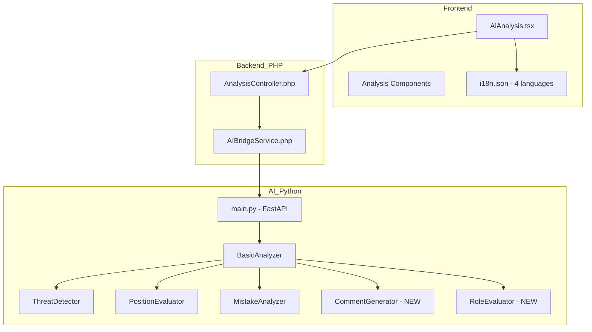
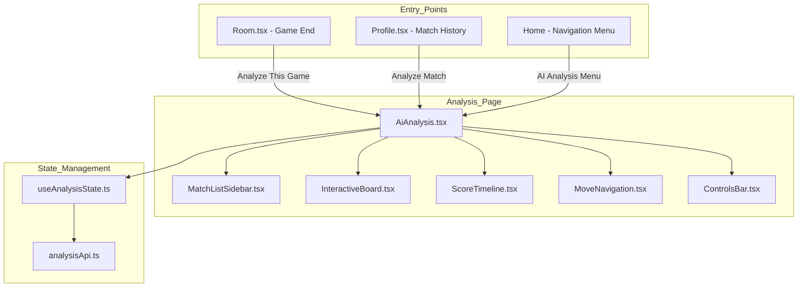

# Design Document: Gomoku Basic Analysis Improvement

## Overview

Cải thiện hệ thống AI Match Analysis cho Gomoku/Caro, tập trung vào phiên bản BASIC. Hệ thống hiện tại đã có các module:
- `basic_analyzer.py` - Phân tích game chính
- `threat_detector.py` - Phát hiện đe dọa
- `position_evaluator.py` - Đánh giá vị trí
- `mistake_analyzer.py` - Phân tích sai lầm
- `types.py` - Định nghĩa types

Cải thiện tập trung vào:
1. Nâng cao độ chính xác pattern detection
2. Thêm hệ thống comment đa ngôn ngữ (VI, EN, ZH, JA)
3. Cải thiện move scoring theo vai trò (attacker/defender)
4. Cải thiện UI hiển thị phân tích

## Architecture



## Components and Interfaces

### 1. CommentGenerator (NEW)

Tạo comment đa ngôn ngữ cho mỗi nước đi.

```python
class CommentGenerator:
    """
    Generates multi-language comments for move analysis.
    Supports: vi (Vietnamese), en (English), zh (Chinese), ja (Japanese)
    """
    
    def generate_comment(
        self,
        move_data: MoveAnalysisData,
        language: str = "vi"
    ) -> str:
        """Generate comment in specified language."""
        pass
    
    def generate_all_languages(
        self,
        move_data: MoveAnalysisData
    ) -> Dict[str, str]:
        """Generate comments in all 4 languages."""
        pass
```

### 2. RoleEvaluator (NEW)

Đánh giá vai trò và điểm nước đi theo vai trò.

```python
class RoleEvaluator:
    """
    Evaluates player role (attacker/defender/balanced) and
    scores moves based on role-appropriate criteria.
    """
    
    def determine_role(
        self,
        board_evaluation: float,
        player: str
    ) -> str:
        """Determine player role based on board evaluation."""
        pass
    
    def score_move_by_role(
        self,
        move_data: MoveAnalysisData,
        role: str
    ) -> float:
        """Score move (0-10) based on role criteria."""
        pass
```

### 3. Enhanced BasicAnalyzer

Cải thiện BasicAnalyzer hiện có với:
- Tích hợp CommentGenerator
- Tích hợp RoleEvaluator
- Cải thiện pattern detection

```python
class BasicAnalyzer:
    def __init__(self):
        self.threat_detector = ThreatDetector()
        self.position_evaluator = PositionEvaluator()
        self.comment_generator = CommentGenerator()  # NEW
        self.role_evaluator = RoleEvaluator()  # NEW
    
    def analyze_game(
        self,
        moves: List[Move],
        language: str = "vi"
    ) -> AnalysisResult:
        """Analyze game with multi-language support."""
        pass
```

### 4. Enhanced MoveAnalysis Output

```python
@dataclass
class EnhancedMoveAnalysis:
    move_number: int
    player: str
    position: str  # Standard notation (e.g., "H8")
    role: str  # "attacker", "defender", "balanced"
    
    board_evaluation: BoardEvaluation
    move_analysis: MoveAnalysisDetail
    alternatives: List[AlternativeMove]
    
    comments: Dict[str, str]  # {vi, en, zh, ja}
    
@dataclass
class BoardEvaluation:
    before_move: float
    after_move: float
    change: float
    is_significant: bool  # change > 20
    is_critical: bool  # change > 50

@dataclass
class MoveAnalysisDetail:
    type: str  # "offensive", "defensive", "balanced"
    rating: str  # "excellent", "good", "average", "poor", "blunder"
    score: float  # 0.0 - 10.0
    primary_purpose: str
    threats_created: List[ThreatInfo]
    threats_blocked: List[ThreatInfo]
    tactical_elements: List[str]

@dataclass
class AlternativeMove:
    position: str  # Standard notation
    score: float
    reason: str
    is_best: bool
```

## Data Models

### Comment Templates Structure

```python
COMMENT_TEMPLATES = {
    "vi": {
        "excellent": [
            "Nước đi xuất sắc! {reason}",
            "Tuyệt vời! {reason}",
        ],
        "good": [
            "Nước đi tốt. {reason}",
            "Lựa chọn hợp lý. {reason}",
        ],
        "average": [
            "Nước đi chấp nhận được. {reason}",
            "Có thể chơi tốt hơn. {reason}",
        ],
        "poor": [
            "Nước đi yếu. {reason}",
            "Bỏ lỡ cơ hội tốt hơn. {reason}",
        ],
        "blunder": [
            "Sai lầm nghiêm trọng! {reason}",
            "Lỗi lớn! {reason}",
        ],
        "fork_created": "Tạo fork (đa đường) - đối thủ chỉ chặn được 1 đường!",
        "threat_blocked": "Chặn đe dọa {threat_type} của đối thủ.",
        "counter_attack": "Vừa phòng thủ vừa tạo phản công!",
    },
    "en": {
        "excellent": [
            "Excellent move! {reason}",
            "Brilliant! {reason}",
        ],
        "good": [
            "Good move. {reason}",
            "Solid choice. {reason}",
        ],
        "average": [
            "Acceptable move. {reason}",
            "Could be better. {reason}",
        ],
        "poor": [
            "Weak move. {reason}",
            "Missed a better opportunity. {reason}",
        ],
        "blunder": [
            "Serious mistake! {reason}",
            "Major error! {reason}",
        ],
        "fork_created": "Created a fork - opponent can only block one threat!",
        "threat_blocked": "Blocked opponent's {threat_type}.",
        "counter_attack": "Defensive move with counter-attack!",
    },
    "zh": {
        "excellent": [
            "精彩的一步！{reason}",
            "太棒了！{reason}",
        ],
        "good": [
            "好棋。{reason}",
            "合理的选择。{reason}",
        ],
        "average": [
            "可以接受的一步。{reason}",
            "可以下得更好。{reason}",
        ],
        "poor": [
            "弱棋。{reason}",
            "错过了更好的机会。{reason}",
        ],
        "blunder": [
            "严重失误！{reason}",
            "大错！{reason}",
        ],
        "fork_created": "形成双杀 - 对手只能挡住一边！",
        "threat_blocked": "挡住了对手的{threat_type}。",
        "counter_attack": "防守的同时发起反击！",
    },
    "ja": {
        "excellent": [
            "素晴らしい一手！{reason}",
            "見事！{reason}",
        ],
        "good": [
            "良い手です。{reason}",
            "堅実な選択。{reason}",
        ],
        "average": [
            "まずまずの手。{reason}",
            "もっと良い手があります。{reason}",
        ],
        "poor": [
            "弱い手。{reason}",
            "より良い機会を逃しました。{reason}",
        ],
        "blunder": [
            "重大なミス！{reason}",
            "大きな間違い！{reason}",
        ],
        "fork_created": "フォーク（二重脅威）を作成 - 相手は一方しか防げません！",
        "threat_blocked": "相手の{threat_type}をブロック。",
        "counter_attack": "防御しながら反撃！",
    },
}
```

### Threat Type Labels (Multi-language)

```python
THREAT_LABELS = {
    "vi": {
        "FIVE": "Ngũ (5 quân)",
        "OPEN_FOUR": "Tứ Mở",
        "FOUR": "Tứ Kín",
        "OPEN_THREE": "Tam Mở",
        "THREE": "Tam Kín",
        "FORK": "Fork (Đa đường)",
    },
    "en": {
        "FIVE": "Five in a row",
        "OPEN_FOUR": "Open Four",
        "FOUR": "Closed Four",
        "OPEN_THREE": "Open Three",
        "THREE": "Closed Three",
        "FORK": "Fork",
    },
    "zh": {
        "FIVE": "五连",
        "OPEN_FOUR": "活四",
        "FOUR": "冲四",
        "OPEN_THREE": "活三",
        "THREE": "眠三",
        "FORK": "双杀",
    },
    "ja": {
        "FIVE": "五連",
        "OPEN_FOUR": "四々",
        "FOUR": "四",
        "OPEN_THREE": "三々",
        "THREE": "三",
        "FORK": "フォーク",
    },
}
```

## Correctness Properties

*A property is a characteristic or behavior that should hold true across all valid executions of a system-essentially, a formal statement about what the system should do. Properties serve as the bridge between human-readable specifications and machine-verifiable correctness guarantees.*

### Property 1: Pattern Detection Accuracy
*For any* board with a known FIVE pattern, the threat detector SHALL detect it with 100% accuracy.
**Validates: Requirements 1.1**

### Property 2: Pattern Detection - Open Four
*For any* board with a known OPEN_FOUR pattern (_XXXX_), the threat detector SHALL detect it with 100% accuracy.
**Validates: Requirements 1.2**

### Property 3: Pattern Detection - Closed Four
*For any* board with a known CLOSED_FOUR pattern, the threat detector SHALL detect it with 100% accuracy.
**Validates: Requirements 1.3**

### Property 4: Pattern Detection - Open Three
*For any* board with a known OPEN_THREE pattern (_XXX_), the threat detector SHALL detect it with 100% accuracy.
**Validates: Requirements 1.4**

### Property 5: Move Score Range Invariant
*For any* move evaluation, the returned score SHALL be in the range [0.0, 10.0].
**Validates: Requirements 2.1**

### Property 6: Move Classification Consistency
*For any* move score, the classification SHALL follow the defined thresholds: excellent (9-10), good (7-8), average (5-6), poor (3-4), blunder (0-2).
**Validates: Requirements 2.2, 2.3, 2.4, 2.5, 2.6**

### Property 7: Role Assignment Consistency
*For any* board evaluation, role assignment SHALL follow: >+20 → X attacker, <-20 → X defender, else balanced.
**Validates: Requirements 3.1, 3.2, 3.3**

### Property 8: Attacker Move Scoring
*For any* attacker move that creates more threats, the score SHALL be higher than a move creating fewer threats.
**Validates: Requirements 3.4**

### Property 9: Defender Move Scoring
*For any* defender move that blocks a higher priority threat, the score SHALL be higher than blocking a lower priority threat.
**Validates: Requirements 3.5**

### Property 10: Multi-Language Comment Availability
*For any* move analysis, comments SHALL be available in all 4 languages (vi, en, zh, ja).
**Validates: Requirements 4.1**

### Property 11: Alternative Move Count
*For any* move analysis, the number of alternative suggestions SHALL be between 2 and 3.
**Validates: Requirements 5.1**

### Property 12: Alternative Move Reason
*For any* alternative move suggestion, the reason field SHALL be non-empty.
**Validates: Requirements 5.2**

### Property 13: Timeline Evaluation Completeness
*For any* game analysis, the timeline SHALL have board evaluation for every move.
**Validates: Requirements 6.1**

### Property 14: Significant Moment Detection
*For any* move with evaluation change > 20, the move SHALL be marked as significant.
**Validates: Requirements 6.2**

### Property 15: Critical Turning Point Detection
*For any* move with evaluation change > 50, the move SHALL be flagged as critical turning point.
**Validates: Requirements 6.4**

### Property 16: Coordinate Notation Format
*For any* coordinate in analysis output, it SHALL match the pattern [A-O][1-9] or [A-O]1[0-5].
**Validates: Requirements 8.1**

### Property 17: Coordinate Conversion Round-Trip
*For any* valid notation, converting to index and back SHALL produce the original notation.
**Validates: Requirements 8.2**

### Property 18: Case-Insensitive Notation Input
*For any* valid notation in lowercase, the system SHALL accept it and convert to uppercase.
**Validates: Requirements 8.3**

### Property 19: Invalid Notation Rejection
*For any* invalid notation (P1, A16, A0, etc.), the system SHALL raise a validation error.
**Validates: Requirements 8.4**

### Property 20: Full Game Analysis Performance
*For any* game with up to 225 moves, analysis SHALL complete within 2000 milliseconds.
**Validates: Requirements 9.1**

### Property 21: Single Move Analysis Performance
*For any* single move analysis, it SHALL complete within 100 milliseconds.
**Validates: Requirements 9.2**

### Property 22: JSON Serialization Validity
*For any* analysis result, serialization SHALL produce valid JSON.
**Validates: Requirements 11.1**

### Property 23: JSON Round-Trip Consistency
*For any* analysis result, deserialize(serialize(result)) SHALL equal the original result.
**Validates: Requirements 11.2**

### Property 24: Serialization Completeness
*For any* serialized analysis result, it SHALL contain all required fields: timeline, mistakes, patterns, best_move, summary.
**Validates: Requirements 11.3**

### Property 25: Board State Validation
*For any* board input, the system SHALL validate it is a 15x15 grid with valid cell values (empty, X, O).
**Validates: Requirements 12.1, 12.2, 12.5**

### Property 26: Edge Case - Insufficient Moves
*For any* game with less than 5 moves, the system SHALL return an appropriate message instead of analysis.
**Validates: Requirements 13.1**

### Property 27: Edge Case - Board Edge Patterns
*For any* pattern at board edge, the system SHALL detect it correctly without out-of-bounds errors.
**Validates: Requirements 13.2**

### Property 28: Comment Quality - Length
*For any* generated comment, the length SHALL be between 20 and 200 characters.
**Validates: Requirements 14.1**

### Property 29: Comment Quality - Blunder Explanation
*For any* blunder move, the comment SHALL include what was wrong and suggest an alternative.
**Validates: Requirements 14.2**

### Property 30: Pattern Priority Ordering
*For any* defensive situation with multiple threats, the system SHALL recommend blocking in priority order: FIVE > OPEN_FOUR > FORK > CLOSED_FOUR > OPEN_THREE.
**Validates: Requirements 15.1, 15.2**

### Property 31: UI - Analysis Button Visibility
*For any* completed game, the UI SHALL display an "Analyze" button.
**Validates: Requirements 16.1, 16.2**

### Property 32: UI - Move Score Display
*For any* analyzed move, the UI SHALL display the score (0-10) with appropriate color coding.
**Validates: Requirements 17.1, 17.2, 17.3, 17.4**

### Property 33: UI - Timeline Visualization
*For any* game analysis, the timeline SHALL show evaluation changes with significant/critical markers.
**Validates: Requirements 18.1, 18.4, 18.5**

### Property 34: UI - Language Switching
*For any* language change, the UI SHALL update comments immediately without re-analyzing.
**Validates: Requirements 19.2**

### Property 35: Analysis Accuracy - Overall
*For any* set of test games with expert ratings, the AI analysis SHALL achieve at least 85% accuracy.
**Validates: Requirements 21.1**

### Property 36: Analysis Accuracy - Blunder Detection
*For any* known blunder move in test data, the AI SHALL correctly identify it as blunder (score 0-2) at least 90% of the time.
**Validates: Requirements 21.2**

### Property 37: Analysis Accuracy - Excellent Move Detection
*For any* known excellent move in test data, the AI SHALL correctly identify it as excellent (score 9-10) at least 80% of the time.
**Validates: Requirements 21.3**

### Property 38: Test Data Completeness
*For any* test game in the repository, it SHALL contain moves list, expected ratings, and expected patterns.
**Validates: Requirements 22.2, 22.3**

---

## Critical Improvement Properties (GAP 9-25)

### Property 39: Game Metadata Support
*For any* analysis request with metadata, the system SHALL accept and process game_type, rule_variant, time_control, and player_elo fields.
**Validates: Requirements 14.1**

### Property 40: Context-Aware Strictness
*For any* tournament game, the mistake threshold SHALL be stricter than casual games (e.g., score 6 in tournament = "poor", score 6 in casual = "average").
**Validates: Requirements 14.2, 14.3**

### Property 41: ELO-Based Comment Complexity
*For any* player with ELO < 1200, comments SHALL use simple vocabulary and avoid technical terms.
**Validates: Requirements 14.4**

### Property 42: Opening Move Near Center
*For any* opening move (moves 1-10) within 3 cells of H8, the system SHALL rate it positively (score ≥ 6).
**Validates: Requirements 15.1**

### Property 43: Opening Move at Corner
*For any* opening move at board corner (A1, O1, A15, O15), the system SHALL rate it as "poor" (score ≤ 4).
**Validates: Requirements 15.2**

### Property 44: Opening Move at Edge Warning
*For any* opening move at board edge without clear tactical reason, the system SHALL include warning about limited development.
**Validates: Requirements 15.3**

### Property 45: VCF Detection (3-move depth)
*For any* position with forced win in ≤3 moves, the system SHALL detect and report the winning sequence.
**Validates: Requirements 16.1**

### Property 46: Missed Win Detection
*For any* move that misses a forced win, the system SHALL rate it as "blunder" and show the winning sequence.
**Validates: Requirements 16.3**

### Property 47: Double Block Recognition
*For any* move that blocks two threats simultaneously, the system SHALL recognize and praise it with appropriate comment.
**Validates: Requirements 17.1**

### Property 48: Defensive Pattern Names
*For any* recognized defensive pattern, the system SHALL use Vietnamese pattern names (Chặn Kép, Chặn Hi Sinh, Chặn Phòng Ngừa).
**Validates: Requirements 17.4**

### Property 49: Progressive Disclosure Default Level
*For any* user with ELO < 1500, the UI SHALL default to Level 1 (Summary) view.
**Validates: Requirements 18.4**

### Property 50: Forcing Move Detection
*For any* move that creates immediate threat requiring response, the system SHALL mark it as "forcing" with tempo gain indicator.
**Validates: Requirements 19.1**

### Property 51: Tempo Switch Detection
*For any* game, the system SHALL correctly identify points where initiative changes between players.
**Validates: Requirements 19.3**

### Property 52: Cache Hit Performance
*For any* previously analyzed position, the cached result SHALL be returned within 10ms.
**Validates: Requirements 20.1**

### Property 53: Cache Performance Improvement
*For any* cached analysis, the response time SHALL be at least 5x faster than uncached analysis.
**Validates: Requirements 20.4**

### Property 54: API Version Support
*For any* API call, the system SHALL support both /api/v1/analyze and /api/v2/analyze endpoints.
**Validates: Requirements 21.1**

### Property 55: API Deprecation Warning
*For any* v1 API call, the response SHALL include header "X-API-Deprecated: true".
**Validates: Requirements 21.3**

### Property 56: Cultural Idiom - Vietnamese
*For any* fork move with Vietnamese language, the comment SHALL include Vietnamese idiom (e.g., "một mũi tên trúng hai đích").
**Validates: Requirements 22.1**

### Property 57: Cultural Idiom - Chinese
*For any* fork move with Chinese language, the comment SHALL include Chinese idiom (e.g., "一石二鸟").
**Validates: Requirements 22.2**

### Property 58: What-If Simulation
*For any* empty cell clicked during analysis, the system SHALL simulate the move and return expected outcome within 500ms.
**Validates: Requirements 23.1, 23.2**

### Property 59: Player Profile Building
*For any* player with ≥5 analyzed games, the system SHALL build and return a player profile with offense/defense ratio.
**Validates: Requirements 24.1, 24.2**

### Property 60: Performance Metrics Logging
*For any* completed analysis, the system SHALL log performance metrics (total_time, pattern_detection_time, evaluation_time).
**Validates: Requirements 25.1**

### Property 61: Error Logging with Context
*For any* analysis error, the system SHALL log error details with context (game_id, user_id, language).
**Validates: Requirements 25.3**

## Error Handling

### Error Code System

```python
from enum import Enum

class AnalysisErrorCode(Enum):
    INVALID_BOARD_STATE = "E001"
    INVALID_NOTATION = "E002"
    INVALID_MOVE_SEQUENCE = "E003"
    INSUFFICIENT_MOVES = "E004"
    ANALYSIS_TIMEOUT = "E005"
    UNSUPPORTED_LANGUAGE = "E006"
    PATTERN_DETECTION_FAILED = "E007"

class AnalysisError(Exception):
    def __init__(self, code: AnalysisErrorCode, details: str, language: str = "vi"):
        self.code = code
        self.details = details
        self.message = ERROR_MESSAGES[code][language].format(details=details)

ERROR_MESSAGES = {
    AnalysisErrorCode.INVALID_BOARD_STATE: {
        "vi": "Trạng thái bàn cờ không hợp lệ: {details}",
        "en": "Invalid board state: {details}",
        "zh": "无效的棋盘状态：{details}",
        "ja": "無効な盤面状態：{details}"
    },
    AnalysisErrorCode.INVALID_NOTATION: {
        "vi": "Ký hiệu không hợp lệ: {details}. Sử dụng định dạng A1-O15.",
        "en": "Invalid notation: {details}. Use format A1-O15.",
        "zh": "无效的符号：{details}。使用格式 A1-O15。",
        "ja": "無効な表記：{details}。A1-O15の形式を使用してください。"
    },
    AnalysisErrorCode.INSUFFICIENT_MOVES: {
        "vi": "Không đủ nước đi để phân tích (cần ít nhất 5 nước)",
        "en": "Insufficient moves for analysis (need at least 5 moves)",
        "zh": "棋步不足，无法分析（至少需要5步）",
        "ja": "分析に必要な手数が不足しています（最低5手必要）"
    },
    AnalysisErrorCode.ANALYSIS_TIMEOUT: {
        "vi": "Phân tích quá thời gian cho phép",
        "en": "Analysis timed out",
        "zh": "分析超时",
        "ja": "分析がタイムアウトしました"
    },
}
```

### Error Handling Rules

1. **Invalid Board State**: Return error with details about invalid cells
2. **Invalid Notation**: Return validation error with expected format
3. **Analysis Timeout**: Return partial results with timeout flag
4. **Language Not Supported**: Fall back to Vietnamese (vi)
5. **Insufficient Moves**: Return message explaining minimum requirement

## Integration Plan

### Existing Files to Modify

| File | Changes | Impact |
|------|---------|--------|
| `ai/analysis/basic_analyzer.py` | Add RoleEvaluator, CommentGenerator integration | Core file - many changes |
| `ai/analysis/threat_detector.py` | Improve pattern detection accuracy | Minor changes |
| `ai/analysis/position_evaluator.py` | Update scoring to 0-10 scale | Moderate changes |
| `ai/analysis/mistake_analyzer.py` | Use new move scores | Minor changes |
| `ai/main.py` | Add language parameter to endpoints | Minor changes |
| `backend/app/Services/AIBridgeService.php` | Pass language parameter | Minor changes |
| `frontend/src/pages/AiAnalysis.tsx` | Update to use new analysis format | Moderate changes |
| `frontend/src/i18n.json` | Add analysis translations | Additions only |

### New Files to Create

| File | Purpose |
|------|---------|
| `ai/analysis/role_evaluator.py` | Role-based move evaluation |
| `ai/analysis/comment_generator.py` | Multi-language comment generation |
| `ai/analysis/coordinate_utils.py` | Coordinate notation utilities |
| `ai/analysis/pattern_priority.py` | Pattern priority definitions |

### Backward Compatibility

- Old API endpoints SHALL continue to work
- Add new `language` parameter as optional (default: "vi")
- Old analysis format SHALL be supported for 2 versions

---

## Critical Improvement Components (GAP 9-25)

### 5. GameMetadataHandler (NEW - GAP 9)

```python
@dataclass
class GameMetadata:
    game_type: str  # "tournament", "ranked", "casual"
    rule_variant: str  # "standard", "renju", "swap2", "pro"
    time_control: str  # "blitz", "rapid", "classical"
    white_elo: Optional[int] = None
    black_elo: Optional[int] = None
    result: Optional[str] = None  # "black_win", "white_win", "draw"
    decisive_move: Optional[int] = None

class GameMetadataHandler:
    def get_strictness_multiplier(self, metadata: GameMetadata) -> float:
        """Tournament = 1.2x stricter, Casual = 0.8x more lenient"""
        pass
    
    def get_comment_complexity(self, elo: int) -> str:
        """beginner (<1200), intermediate (1200-1600), advanced (>1600)"""
        pass
```

### 6. OpeningEvaluator (NEW - GAP 10)

```python
class OpeningEvaluator:
    """Evaluates opening moves (1-10) based on opening principles"""
    
    CENTER = (7, 7)  # H8
    CORNERS = [(0, 0), (0, 14), (14, 0), (14, 14)]
    EDGE_COLS = [0, 1, 2, 12, 13, 14]  # A-C, M-O
    EDGE_ROWS = [0, 1, 2, 12, 13, 14]  # 1-3, 13-15
    
    def evaluate_opening_move(self, row: int, col: int, move_num: int) -> OpeningEvaluation:
        """Evaluate opening move based on principles"""
        pass
    
    def is_near_center(self, row: int, col: int, distance: int = 3) -> bool:
        """Check if position is within distance of center"""
        pass
    
    def is_corner(self, row: int, col: int) -> bool:
        """Check if position is at corner"""
        pass
    
    def is_edge(self, row: int, col: int) -> bool:
        """Check if position is at edge"""
        pass

@dataclass
class OpeningEvaluation:
    is_good: bool
    reason: str
    score_modifier: float  # -2.0 to +2.0
```

### 7. VCFDetector (NEW - GAP 11)

```python
class VCFDetector:
    """Detect Victory by Continuous Four (simple version for BASIC tier)"""
    
    def detect_vcf(self, board: List[List[int]], player: int, max_depth: int = 3) -> Optional[VCFResult]:
        """
        Detect if player has forced win in max_depth moves.
        Returns winning sequence if found.
        """
        pass
    
    def is_position_lost(self, board: List[List[int]], player: int) -> bool:
        """Check if opponent has VCF (position is lost)"""
        pass

@dataclass
class VCFResult:
    has_vcf: bool
    winning_sequence: List[str]  # ["H9", "I8", "J7"]
    depth: int
```

### 8. DefensivePatternRecognizer (NEW - GAP 12)

```python
class DefensivePatternRecognizer:
    """Recognize defensive patterns"""
    
    def detect_double_block(self, board, move, threats_before, threats_after) -> Optional[DefensivePattern]:
        """Detect if move blocks 2+ threats simultaneously"""
        pass
    
    def detect_sacrifice_block(self, board, move, threats_before, threats_after) -> Optional[DefensivePattern]:
        """Detect if move sacrifices blocking one threat for counter-attack"""
        pass
    
    def detect_preventive_block(self, board, move, opponent_potential_forks) -> Optional[DefensivePattern]:
        """Detect if move prevents opponent from creating fork"""
        pass

@dataclass
class DefensivePattern:
    pattern_type: str  # "double_block", "sacrifice_block", "preventive_block"
    pattern_name_vi: str  # "Chặn Kép", "Chặn Hi Sinh", "Chặn Phòng Ngừa"
    threats_blocked: List[ThreatInfo]
    explanation: str
```

### 9. TempoAnalyzer (NEW - GAP 16)

```python
class TempoAnalyzer:
    """Analyze tempo and initiative throughout the game"""
    
    def analyze_tempo(self, move_data: MoveAnalysisData) -> TempoAnalysis:
        """Analyze tempo for a single move"""
        pass
    
    def detect_tempo_switch(self, timeline: List[MoveAnalysis]) -> List[int]:
        """Detect move numbers where initiative switches"""
        pass

@dataclass
class TempoAnalysis:
    is_forcing: bool  # Opponent MUST respond
    tempo_change: int  # +1 (gain), 0 (neutral), -1 (loss)
    initiative_holder: str  # "X", "O", "neutral"
    explanation: str
```

### 10. AnalysisCache (NEW - GAP 20)

```python
from functools import lru_cache
from cachetools import TTLCache

class AnalysisCache:
    """Caching layer for analysis performance"""
    
    def __init__(self):
        self._position_cache = TTLCache(maxsize=10000, ttl=600)
        self._pattern_cache = TTLCache(maxsize=5000, ttl=600)
        self._comment_templates = {}  # Pre-loaded at startup
    
    @lru_cache(maxsize=10000)
    def get_position_evaluation(self, board_hash: str) -> float:
        """Cached position evaluation"""
        pass
    
    def get_patterns(self, board_hash: str) -> Optional[List[Pattern]]:
        """Get cached patterns or None"""
        pass
    
    def preload_comment_templates(self):
        """Load all comment templates at startup"""
        self._comment_templates = {
            "vi": load_comments("vi"),
            "en": load_comments("en"),
            "zh": load_comments("zh"),
            "ja": load_comments("ja")
        }
```

### 11. CulturalCommentGenerator (Enhanced - GAP 22)

```python
CULTURAL_IDIOMS = {
    "vi": {
        "excellent_fork": "Nước đi 'một mũi tên trúng hai đích'!",
        "missed_win": "Bỏ lỡ 'cơ hội vàng'!",
        "defensive_comeback": "Phòng thủ 'lấy yếu thắng mạnh'!",
        "trap_setup": "Chiêu 'dụ hổ rời núi'!"
    },
    "en": {
        "excellent_fork": "Double threat brilliancy!",
        "missed_win": "Missed mate!",
        "defensive_comeback": "Defensive masterpiece!",
        "trap_setup": "Tactical trap!"
    },
    "zh": {
        "excellent_fork": "一石二鸟！",
        "missed_win": "功亏一篑！",
        "defensive_comeback": "后发制人！",
        "trap_setup": "声东击西！"
    },
    "ja": {
        "excellent_fork": "一石二鳥！",
        "missed_win": "詰めが甘い！",
        "defensive_comeback": "捲土重来！",
        "trap_setup": "陽動作戦！"
    }
}
```

### 12. WhatIfSimulator (NEW - GAP 23)

```python
class WhatIfSimulator:
    """Simulate 'what if' scenarios for interactive learning"""
    
    def simulate_move(self, board: List[List[int]], move: str, depth: int = 3) -> WhatIfResult:
        """
        Simulate a move and calculate expected outcome.
        Returns board evaluation change and opponent's best response.
        """
        pass

@dataclass
class WhatIfResult:
    alternative_position: str  # "G9"
    simulation_depth: int
    board_eval_change: float
    threats_created: List[ThreatInfo]
    opponent_best_response: str
    final_evaluation: str  # "better", "worse", "equal"
    explanation: str
```

### 13. PlayerProfileBuilder (NEW - GAP 24)

```python
class PlayerProfileBuilder:
    """Build player profile from multiple games"""
    
    def build_profile(self, player_id: str, games: List[AnalysisResult]) -> PlayerProfile:
        """Build profile from ≥5 analyzed games"""
        pass
    
    def compare_with_history(self, current_game: AnalysisResult, profile: PlayerProfile) -> Comparison:
        """Compare current game with historical tendencies"""
        pass

@dataclass
class PlayerProfile:
    player_id: str
    games_analyzed: int
    offense_defense_ratio: float  # 0.0 (pure defense) to 1.0 (pure offense)
    aggression_level: str  # "passive", "moderate", "aggressive"
    favorite_patterns: List[str]
    common_mistakes: List[str]
    strengths: List[str]
    weaknesses: List[str]
    improvement_areas: List[str]
```

### 14. AnalysisMetricsLogger (NEW - GAP 25)

```python
import structlog
from dataclasses import dataclass

logger = structlog.get_logger()

@dataclass
class AnalysisMetrics:
    # Performance metrics
    total_analysis_time_ms: float
    pattern_detection_time_ms: float
    evaluation_time_ms: float
    comment_generation_time_ms: float
    
    # Quality metrics
    patterns_detected: int
    threats_detected: int
    mistakes_identified: int
    alternatives_suggested: int
    
    # Context
    language_requested: str
    game_length: int
    analysis_depth: str  # "quick", "standard", "deep"

class AnalysisMetricsLogger:
    def log_analysis_complete(self, game_id: str, user_id: str, metrics: AnalysisMetrics):
        logger.info("analysis_completed",
                    game_id=game_id,
                    user_id=user_id,
                    duration_ms=metrics.total_analysis_time_ms,
                    patterns_found=metrics.patterns_detected)
    
    def log_analysis_error(self, game_id: str, user_id: str, error: Exception, language: str):
        logger.error("analysis_failed",
                     game_id=game_id,
                     user_id=user_id,
                     language=language,
                     error=str(error))
```

### 15. Progressive Disclosure UI Component

```typescript
// Frontend: ProgressiveAnalysisView.tsx
interface AnalysisViewProps {
  level: 'summary' | 'detailed' | 'expert';
  userElo?: number;
  moveAnalysis: MoveAnalysis;
}

const ProgressiveAnalysisView: React.FC<AnalysisViewProps> = ({ level, userElo, moveAnalysis }) => {
  // Auto-select level based on user skill
  const defaultLevel = useMemo(() => {
    if (!userElo || userElo < 1500) return 'summary';
    if (userElo <= 1800) return 'detailed';
    return 'detailed'; // Expert is opt-in
  }, [userElo]);
  
  const [currentLevel, setCurrentLevel] = useState(level || defaultLevel);
  
  return (
    <div className="analysis-view">
      {/* Level 1: Summary - Always visible */}
      <div className="summary">
        <ScoreBadge score={moveAnalysis.score} rating={moveAnalysis.rating} />
        <p className="one-line-comment">{moveAnalysis.comment}</p>
      </div>
      
      {/* Level 2: Detailed - Click to expand */}
      {currentLevel !== 'summary' && (
        <div className="detailed">
          <ThreatsDisplay threats={moveAnalysis.threats_created} />
          <EvaluationChange before={moveAnalysis.eval_before} after={moveAnalysis.eval_after} />
          <AlternativesList alternatives={moveAnalysis.alternatives} />
        </div>
      )}
      
      {/* Level 3: Expert - Toggle advanced */}
      {currentLevel === 'expert' && (
        <div className="expert">
          <PatternDetails patterns={moveAnalysis.patterns} />
          <DirectionAnalysis directions={moveAnalysis.all_directions} />
          <TacticalElements elements={moveAnalysis.tactical_elements} />
        </div>
      )}
      
      <LevelToggle current={currentLevel} onChange={setCurrentLevel} />
    </div>
  );
};
```

## UI Integration Architecture



### UI Component Updates

#### 1. Room.tsx - Post-Game Analysis Button
```tsx
// Add after game ends
{gameEnded && (
  <Button 
    onClick={() => navigate(`/analysis?matchId=${matchId}`)}
    variant="primary"
  >
    {t('analysis.analyzeThisGame')}
  </Button>
)}
```

#### 2. Profile.tsx - Match History with Analyze
```tsx
// In match history list
<Button 
  size="sm"
  onClick={() => navigate(`/analysis?matchId=${match.id}`)}
>
  {t('analysis.analyze')}
</Button>
```

#### 3. Navigation Menu Update
```tsx
// In App.tsx or Navigation component
<NavLink to="/analysis">
  {t('nav.aiAnalysis')}
</NavLink>
```

## Performance Benchmarks

| Module | Operation | Max Time | Property |
|--------|-----------|----------|----------|
| ThreatDetector | detect_all_threats() | 50ms | Property 25 |
| PositionEvaluator | evaluate_position() | 30ms | Property 26 |
| RoleEvaluator | score_move_by_role() | 20ms | Property 27 |
| CommentGenerator | generate_comment() | 10ms | Property 28 |
| BasicAnalyzer | analyze_single_move() | 100ms | Property 21 |
| BasicAnalyzer | analyze_full_game() | 2000ms | Property 20 |

## Test Data Schema

### Test Game JSON Format

```json
{
  "game_id": "test_001",
  "description": "Fork creation example - X creates double threat",
  "difficulty": "beginner",
  "moves": [
    {"move_num": 1, "player": "X", "row": 7, "col": 7, "notation": "H8"},
    {"move_num": 2, "player": "O", "row": 7, "col": 8, "notation": "I8"},
    {"move_num": 3, "player": "X", "row": 6, "col": 7, "notation": "H7"}
  ],
  "expected_analysis": {
    "move_15": {
      "rating": "excellent",
      "score_min": 9.0,
      "score_max": 10.0,
      "threats_created": ["FORK", "OPEN_THREE"],
      "comment_should_contain": ["fork", "đa đường"]
    },
    "move_20": {
      "rating": "blunder",
      "score_min": 0.0,
      "score_max": 2.0,
      "missed_threat": "OPEN_FOUR",
      "best_alternative": {"row": 5, "col": 8, "notation": "I6"}
    }
  },
  "expected_patterns": [
    {"type": "FORK", "player": "X", "move_created": 15},
    {"type": "OPEN_FOUR", "player": "X", "move_created": 17}
  ],
  "edge_cases": ["pattern_at_edge", "overlapping_patterns"]
}
```

### Verification Report Format

```python
@dataclass
class VerificationReport:
    total_moves: int
    correct_ratings: int
    accuracy_percentage: float
    
    blunder_detection: BlunderStats
    excellent_detection: ExcellentStats
    
    false_positives: List[Discrepancy]  # AI says bad, actually good
    false_negatives: List[Discrepancy]  # AI says good, actually bad
    
    pattern_accuracy: float
    
@dataclass
class Discrepancy:
    move_num: int
    expected_rating: str
    actual_rating: str
    expected_score: float
    actual_score: float
    notes: str
```

## Testing Strategy

### Dual Testing Approach

**Unit Tests**: Verify specific examples and edge cases
- Test pattern detection with known board positions
- Test coordinate conversion with boundary values
- Test comment generation for each rating level

**Property-Based Tests**: Verify universal properties using Hypothesis library
- Generate random boards and verify pattern detection
- Generate random moves and verify score range
- Generate random games and verify timeline completeness

### Property-Based Testing Framework

Using **Hypothesis** library for Python:

```python
from hypothesis import given, strategies as st, settings

@given(st.lists(st.tuples(st.integers(0, 14), st.integers(0, 14)), min_size=5, max_size=100))
@settings(max_examples=100)
def test_move_score_range(moves):
    """
    **Feature: gomoku-basic-analysis, Property 5: Move Score Range Invariant**
    **Validates: Requirements 2.1**
    """
    # Test implementation
    pass
```

### Test Categories

1. **Pattern Detection Tests** (Properties 1-4)
   - Generate boards with known patterns
   - Verify detection accuracy

2. **Scoring Tests** (Properties 5-9)
   - Generate random moves
   - Verify score range and classification

3. **Multi-Language Tests** (Property 10)
   - Generate move analyses
   - Verify all 4 languages present

4. **Coordinate Tests** (Properties 16-19)
   - Test notation conversion
   - Test validation

5. **Performance Tests** (Properties 20-21)
   - Measure analysis time
   - Verify within limits

6. **Serialization Tests** (Properties 22-24)
   - Test JSON round-trip
   - Verify field completeness
