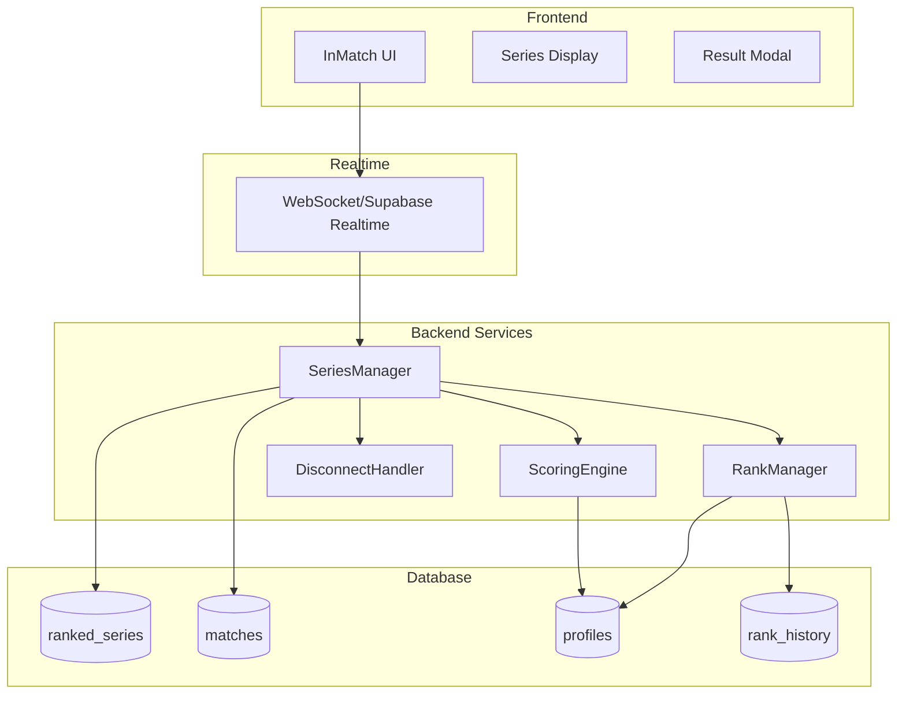

# Design Document - Ranked BO3 System
# supabase_schema.sql là schema chính xác nhất
## Overview

Hệ thống Ranked BO3 quản lý các trận đấu xếp hạng theo thể thức Best of 3. Hệ thống bao gồm:
- **Series Management**: Tạo, quản lý và kết thúc series BO3
- **Game Tracking**: Theo dõi từng ván trong series, swap sides
- **Scoring Engine**: Tính toán Mindpoint, coins, EXP
- **Rank System**: Cập nhật rank dựa trên Mindpoint
- **Disconnect Handling**: Xử lý mất kết nối và abandon

## Architecture



## Components and Interfaces

### 1. SeriesManager (Backend)

```typescript
interface SeriesManager {
  // Tạo series mới khi 2 players được match
  createSeries(player1Id: string, player2Id: string, mode: 'ranked'): Promise<Series>
  
  // Kết thúc một game trong series
  endGame(seriesId: string, winnerId: string, gameData: GameResult): Promise<SeriesState>
  
  // Lấy trạng thái hiện tại của series
  getSeriesState(seriesId: string): Promise<SeriesState>
  
  // Kết thúc series (khi có người thắng 2 ván)
  completeSeries(seriesId: string): Promise<SeriesResult>
  
  // Xử lý forfeit
  forfeitGame(seriesId: string, forfeitPlayerId: string): Promise<SeriesState>
  
  // Xử lý abandon
  abandonSeries(seriesId: string, abandonPlayerId: string): Promise<SeriesResult>
}
```

### 2. ScoringEngine (Backend)

```typescript
interface ScoringEngine {
  // Tính Mindpoint change cho winner
  calculateWinnerMP(series: SeriesResult): number
  
  // Tính Mindpoint change cho loser
  calculateLoserMP(series: SeriesResult): number
  
  // Tính coins reward
  calculateCoins(playerId: string, series: SeriesResult): number
  
  // Tính EXP reward
  calculateEXP(playerId: string, series: SeriesResult): number
  
  // Apply tất cả rewards
  applyRewards(series: SeriesResult): Promise<RewardResult>
}
```

### 3. RankManager (Backend)

```typescript
interface RankManager {
  // Cập nhật Mindpoint và check rank change
  updateMindpoint(playerId: string, mpChange: number): Promise<RankUpdate>
  
  // Lấy rank từ Mindpoint
  getRankFromMP(mindpoint: number): Rank
  
  // Ghi lại rank history
  recordRankChange(playerId: string, oldRank: Rank, newRank: Rank, reason: string): Promise<void>
}
```

### 4. DisconnectHandler (Backend)

```typescript
interface DisconnectHandler {
  // Xử lý disconnect
  handleDisconnect(seriesId: string, playerId: string): Promise<void>
  
  // Xử lý reconnect
  handleReconnect(seriesId: string, playerId: string): Promise<boolean>
  
  // Check timeout và forfeit
  checkTimeout(seriesId: string): Promise<boolean>
}
```

### 5. Frontend Components

```typescript
// Series Display Component
interface SeriesDisplayProps {
  seriesId: string
  player1: Player
  player2: Player
  score: [number, number]  // [player1_wins, player2_wins]
  currentGame: number      // 1, 2, or 3
  playerSides: { player1: 'X' | 'O', player2: 'X' | 'O' }
}

// Game Result Modal
interface GameResultModalProps {
  winner: Player
  seriesScore: [number, number]
  isSeriesComplete: boolean
  nextGameCountdown?: number
}

// Series Result Modal
interface SeriesResultModalProps {
  winner: Player
  finalScore: [number, number]
  mpChange: { winner: number, loser: number }
  coinsEarned: { winner: number, loser: number }
  expEarned: { winner: number, loser: number }
  rankChange?: { player: Player, oldRank: Rank, newRank: Rank }
  showRematchButton: boolean
}
```

## Data Models

### Database Schema

```sql
-- New table: ranked_series
CREATE TABLE public.ranked_series (
  id uuid NOT NULL DEFAULT gen_random_uuid(),
  player1_id uuid NOT NULL REFERENCES profiles(user_id),
  player2_id uuid NOT NULL REFERENCES profiles(user_id),
  player1_initial_mp integer NOT NULL,
  player2_initial_mp integer NOT NULL,
  player1_initial_rank varchar NOT NULL,
  player2_initial_rank varchar NOT NULL,
  player1_wins integer DEFAULT 0,
  player2_wins integer DEFAULT 0,
  games_to_win integer DEFAULT 2,
  current_game integer DEFAULT 1,
  -- Sides for current game
  player1_side varchar DEFAULT 'X' CHECK (player1_side IN ('X', 'O')),
  player2_side varchar DEFAULT 'O' CHECK (player2_side IN ('X', 'O')),
  status varchar DEFAULT 'in_progress' CHECK (status IN ('in_progress', 'completed', 'abandoned')),
  winner_id uuid REFERENCES profiles(user_id),
  final_score varchar, -- e.g., "2-1", "2-0"
  -- Rewards applied
  winner_mp_change integer,
  loser_mp_change integer,
  winner_coins integer,
  loser_coins integer,
  winner_exp integer,
  loser_exp integer,
  -- Timestamps
  created_at timestamp with time zone DEFAULT now(),
  started_at timestamp with time zone,
  ended_at timestamp with time zone,
  CONSTRAINT ranked_series_pkey PRIMARY KEY (id)
);

-- Add series_id to matches table
ALTER TABLE matches ADD COLUMN series_id uuid REFERENCES ranked_series(id);
ALTER TABLE matches ADD COLUMN game_number integer; -- 1, 2, or 3 within series
```

### TypeScript Types

```typescript
interface Series {
  id: string
  player1Id: string
  player2Id: string
  player1InitialMP: number
  player2InitialMP: number
  player1InitialRank: Rank
  player2InitialRank: Rank
  player1Wins: number
  player2Wins: number
  gamesToWin: number  // Always 2 for BO3
  currentGame: number // 1, 2, or 3
  player1Side: 'X' | 'O'
  player2Side: 'X' | 'O'
  status: 'in_progress' | 'completed' | 'abandoned'
  winnerId?: string
  finalScore?: string
  winnerMPChange?: number
  loserMPChange?: number
  winnerCoins?: number
  loserCoins?: number
  winnerExp?: number
  loserExp?: number
  createdAt: Date
  startedAt?: Date
  endedAt?: Date
}

interface SeriesState {
  series: Series
  games: GameResult[]
  isComplete: boolean
  nextGameReady: boolean
}

interface GameResult {
  matchId: string
  seriesId: string
  gameNumber: number
  winnerId: string
  loserId: string
  totalMoves: number
  durationSeconds: number
  winCondition: string
}

interface SeriesResult {
  series: Series
  winnerId: string
  loserId: string
  finalScore: string
  games: GameResult[]
  rewards: {
    winner: { mp: number, coins: number, exp: number }
    loser: { mp: number, coins: number, exp: number }
  }
  rankChanges: RankChange[]
}

interface RankChange {
  playerId: string
  oldRank: Rank
  newRank: Rank
  newMP: number
}

type Rank = 'vo_danh' | 'tan_ky' | 'hoc_ky' | 'ky_lao' | 'cao_ky' | 'ky_thanh' | 'truyen_thuyet'

const RANK_THRESHOLDS: Record<Rank, number> = {
  'vo_danh': 0,
  'tan_ky': 50,
  'hoc_ky': 200,
  'ky_lao': 600,
  'cao_ky': 1500,
  'ky_thanh': 3000,
  'truyen_thuyet': 5500
}

const RANK_VALUES: Record<Rank, number> = {
  'vo_danh': 0,
  'tan_ky': 1,
  'hoc_ky': 2,
  'ky_lao': 3,
  'cao_ky': 4,
  'ky_thanh': 5,
  'truyen_thuyet': 6
}
```

## Correctness Properties

*A property is a characteristic or behavior that should hold true across all valid executions of a system-essentially, a formal statement about what the system should do. Properties serve as the bridge between human-readable specifications and machine-verifiable correctness guarantees.*

### Property 1: Series Initialization Correctness
*For any* two valid players matched in ranked mode, creating a series SHALL result in status "in_progress", score "0-0", games_to_win = 2, and both players' initial MP/rank recorded correctly.
**Validates: Requirements 1.1, 1.3, 1.4**

### Property 2: Side Assignment Fairness
*For any* large number of series created, the distribution of initial X/O assignments SHALL be approximately 50/50 for each player position.
**Validates: Requirements 1.2**

### Property 3: Score Update Consistency
*For any* game result in a series, the series score SHALL be updated by exactly +1 for the winner and +0 for the loser.
**Validates: Requirements 2.1, 2.3**

### Property 4: Series Completion Detection
*For any* series state, the series SHALL be marked complete if and only if either player has exactly 2 wins.
**Validates: Requirements 2.2, 3.1**

### Property 5: Side Swap Correctness
*For any* series transitioning from game N to game N+1, player sides SHALL be swapped (X↔O).
**Validates: Requirements 2.4**

### Property 6: Winner MP Range
*For any* completed series, the winner's MP gain SHALL be in range [5, 50] (minimum 5 due to floor, max 50 with all bonuses).
**Validates: Requirements 3.3, 4.5**

### Property 7: Loser MP Fixed Penalty
*For any* completed series (non-abandoned), the loser's MP loss SHALL be exactly 15.
**Validates: Requirements 3.4**

### Property 8: MP Calculation Formula
*For any* series result, winner MP = 20 (base) + sweep_bonus + time_bonus + rank_diff_modifier, with minimum floor of 5.
**Validates: Requirements 4.1, 4.2, 4.3, 4.4, 4.5**

### Property 9: Sweep Bonus Application
*For any* series ending 2-0, the winner SHALL receive exactly 10 bonus MP.
**Validates: Requirements 4.2**

### Property 10: Rank Threshold Consistency
*For any* player with MP crossing a rank threshold, their rank SHALL be updated to match the new MP range.
**Validates: Requirements 5.1**

### Property 11: Rank History Recording
*For any* rank change, a record SHALL be created in rank_history with correct old_rank, new_rank, and timestamp.
**Validates: Requirements 5.4**

### Property 12: Winner Coins Calculation
*For any* series winner, coins earned SHALL equal 50 + (games_won × 10), resulting in 70 for 2-0 or 70 for 2-1.
**Validates: Requirements 6.2**

### Property 13: Loser Coins Fixed
*For any* series loser, coins earned SHALL be exactly 20.
**Validates: Requirements 6.3**

### Property 14: EXP Distribution
*For any* completed series, winner SHALL receive 100 EXP and loser SHALL receive 40 EXP.
**Validates: Requirements 6.4**

### Property 15: Disconnect Timeout Forfeit
*For any* player disconnected for more than 60 seconds, that game SHALL be forfeited to the opponent.
**Validates: Requirements 7.1, 7.2**

### Property 16: Double Forfeit Series End
*For any* player who forfeits 2 games in a series, the series SHALL end with that player as loser.
**Validates: Requirements 7.3**

### Property 17: Abandon Penalty
*For any* abandoned series, the abandoning player SHALL lose 25 MP (15 standard + 10 abandon penalty).
**Validates: Requirements 7.5**

### Property 18: Series Data Completeness
*For any* completed series, all required fields SHALL be stored: winner_id, final_score, mp_changes, coins, exp.
**Validates: Requirements 9.3**

### Property 19: Game-Series Linkage
*For any* game in a series, the game record SHALL have correct series_id and game_number.
**Validates: Requirements 9.2**

### Property 20: Rematch Creates New Series
*For any* mutual rematch request, a new series SHALL be created with the same players but fresh state.
**Validates: Requirements 10.2**

## Error Handling

### Network Errors
- Disconnect during game: Pause game, start 60s reconnect timer
- Disconnect during series transition: Allow reconnect until next game starts
- Server error: Retry 3 times, then pause series for manual review

### Invalid States
- Player tries to make move when not their turn: Reject with error
- Player tries to abandon when series already complete: Ignore
- Duplicate game end signals: Idempotent handling, ignore duplicates

### Edge Cases
- Both players disconnect: Pause series, first to reconnect continues
- Player disconnects right after winning: Complete game result first, then handle disconnect
- Series abandoned during game 3: Apply abandon penalty, don't count partial game

## Testing Strategy

### Property-Based Testing
- Use Hypothesis (Python) for backend property tests
- Use fast-check (TypeScript) for frontend logic tests
- Minimum 100 iterations per property test

### Unit Tests
- SeriesManager: createSeries, endGame, completeSeries
- ScoringEngine: all calculation methods
- RankManager: updateMindpoint, getRankFromMP

### Integration Tests
- Full series flow: create → game1 → game2 → complete
- Disconnect/reconnect scenarios
- Rematch flow

### Test Annotations
Each property-based test MUST include:
```typescript
// **Feature: ranked-bo3-system, Property N: [property description]**
// **Validates: Requirements X.Y**
```
