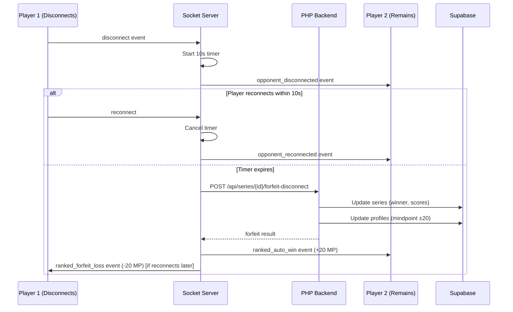

# Design Document: Ranked Disconnect Auto-Win

## Overview

Hệ thống xử lý tự động khi người chơi disconnect trong ranked mode. Khi một người chơi rời khỏi trận đấu ranked, hệ thống sẽ:
1. Phát hiện disconnect trong vòng 5 giây
2. Bắt đầu countdown 10 giây cho grace period
3. Nếu không reconnect, tự động trao chiến thắng cho người còn lại với +20 MP
4. Cập nhật series score và kết thúc series nếu đủ điều kiện

## Architecture



## Components and Interfaces

### 1. Socket Server (server/index.js)

**New Events:**
- `opponent_disconnected` - Emitted to remaining player when opponent disconnects
- `opponent_reconnected` - Emitted when disconnected player reconnects
- `ranked_auto_win` - Emitted to winner with +20 MP reward
- `ranked_forfeit_loss` - Emitted to disconnected player with -20 MP penalty
- `disconnect_countdown` - Emitted every second with remaining time

**New Functions:**
```javascript
// Handle ranked disconnect with auto-win logic
function handleRankedDisconnect(roomId, disconnectedPlayerId) {
  // Start 10s countdown
  // Emit opponent_disconnected to remaining player
  // Set timeout for auto-win
}

// Handle reconnection during grace period
function handleRankedReconnect(roomId, reconnectedPlayerId) {
  // Cancel countdown timer
  // Emit opponent_reconnected
  // Resume game
}

// Process auto-win after timeout
async function processRankedAutoWin(roomId, winnerId, loserId) {
  // Call backend to process forfeit
  // Emit ranked_auto_win to winner
  // Update room state
}
```

### 2. PHP Backend (backend/app/Services/DisconnectHandlerService.php)

**Enhanced Methods:**
```php
// Process forfeit with fixed 20 MP reward/penalty
public function processForfeitDisconnect(
    string $seriesId, 
    string $disconnectedPlayerId
): array {
    // Award winner +20 MP
    // Deduct loser -20 MP
    // Update series score
    // Complete series if 2 wins reached
}
```

### 3. Frontend Components

**New Component: DisconnectOverlay.tsx**
- Shows "Đối thủ đã thoát" message
- Displays 10-second countdown
- Shows auto-win result with +20 MP

**Updated: Room.tsx**
- Listen for disconnect events
- Show DisconnectOverlay when opponent disconnects
- Handle auto-win result

## Data Models

### Disconnect State (In-Memory)
```typescript
interface RankedDisconnectState {
  roomId: string;
  seriesId: string;
  disconnectedPlayerId: string;
  remainingPlayerId: string;
  disconnectedAt: number; // timestamp
  timeoutId: NodeJS.Timeout;
  countdownInterval: NodeJS.Timeout;
}
```

### Forfeit Result (API Response)
```typescript
interface ForfeitDisconnectResult {
  success: boolean;
  winnerId: string;
  loserId: string;
  winnerMpChange: number; // +20
  loserMpChange: number;  // -20
  seriesComplete: boolean;
  finalScore: string; // e.g., "2-0"
  seriesWinnerId?: string;
}
```

## Correctness Properties

*A property is a characteristic or behavior that should hold true across all valid executions of a system-essentially, a formal statement about what the system should do. Properties serve as the bridge between human-readable specifications and machine-verifiable correctness guarantees.*

### Property 1: Disconnect Detection Timing
*For any* ranked game room, when a player disconnects, the system should detect and emit `opponent_disconnected` event within 5 seconds.
**Validates: Requirements 1.1, 1.2**

### Property 2: Auto-Win Timeout Trigger
*For any* ranked game where a player remains disconnected, after exactly 10 seconds the system should declare the remaining player as winner.
**Validates: Requirements 1.3**

### Property 3: Fixed MP Award/Penalty
*For any* ranked forfeit due to disconnect, the winner should receive exactly +20 MP and the disconnected player should lose exactly -20 MP.
**Validates: Requirements 1.4, 1.5**

### Property 4: Forfeit Game State Update
*For any* forfeit in ranked mode, the system should mark the game as forfeit, set the remaining player as winner, and increment their series win count by 1.
**Validates: Requirements 2.1, 2.2**

### Property 5: Series Completion on Forfeit
*For any* series where a forfeit causes a player to reach 2 wins, the series should be marked as complete with correct final results.
**Validates: Requirements 2.3, 2.4, 2.5**

### Property 6: Simultaneous Disconnect Draw
*For any* ranked game where both players disconnect within 5 seconds of each other, the system should declare a draw with no MP changes.
**Validates: Requirements 4.1**

### Property 7: Reconnection Cancels Forfeit
*For any* disconnected player who reconnects within the 10-second grace period, the forfeit process should be cancelled and the game should resume.
**Validates: Requirements 4.2**

### Property 8: Retry on Backend Failure
*For any* forfeit processing that fails, the system should retry up to 3 times before declaring an error.
**Validates: Requirements 4.4**

## Error Handling

### Network Errors
- If backend API fails, retry up to 3 times with exponential backoff
- If all retries fail, log error and keep room in "pending_forfeit" state
- Admin can manually resolve pending forfeits

### Race Conditions
- Use mutex/lock for disconnect state to prevent race conditions
- If reconnect happens during forfeit processing, check state before completing

### Edge Cases
- Both players disconnect: First to reconnect continues, if neither reconnects within 30s, draw
- Player disconnects during Swap2 phase: Same rules apply
- Server restart during countdown: Forfeit state lost, game continues if both reconnect

## Testing Strategy

### Property-Based Testing (Hypothesis)
- Test MP changes are always ±20 for forfeit
- Test series score updates correctly on forfeit
- Test reconnection within grace period cancels forfeit
- Test simultaneous disconnect results in draw

### Unit Tests
- Test countdown timer accuracy
- Test event emission order
- Test state cleanup after forfeit

### Integration Tests
- Test full disconnect → auto-win flow
- Test reconnection during countdown
- Test series completion by forfeit
