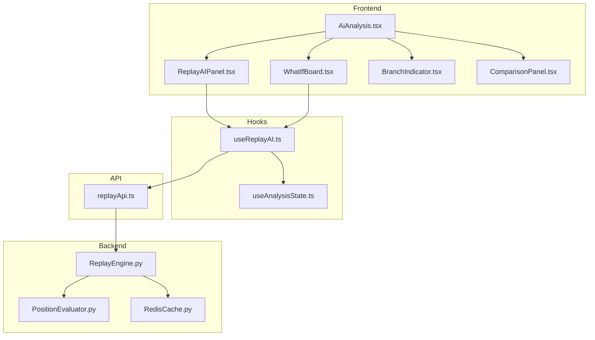

# Design Document - Replay AI Mode

## Overview

Tính năng Replay AI Mode mở rộng chế độ xem lại ván đấu (replay) để cho phép người dùng tương tác với AI. Người dùng có thể chọn bất kỳ vị trí nào trong ván đấu, thử đi nước khác, và AI sẽ phản hồi. Hệ thống so sánh kết quả giữa nhánh gốc và nhánh thử nghiệm để giúp người dùng học hỏi.

### Key Features
- Chuyển đổi giữa Replay Mode và What-If Mode
- AI phản hồi nước đi của người dùng với độ khó có thể điều chỉnh
- So sánh win probability giữa nhánh gốc và nhánh thử nghiệm
- Quản lý session và undo/redo

## Architecture



## Components and Interfaces

### Frontend Components

#### 1. ReplayAIPanel
Panel điều khiển chế độ what-if, hiển thị trong right column của AiAnalysis.

```typescript
interface ReplayAIPanelProps {
  mode: 'replay' | 'what_if'
  sessionId: string | null
  divergencePoint: number | null
  difficulty: 'easy' | 'medium' | 'hard'
  canUndo: boolean
  onEnterWhatIf: () => void
  onExitWhatIf: () => void
  onUndo: () => void
  onDifficultyChange: (difficulty: 'easy' | 'medium' | 'hard') => void
  onAnalyzeDivergence: () => void
}
```

#### 2. WhatIfBoard
Board component mở rộng từ InteractiveBoard, hỗ trợ click để đặt quân trong what-if mode.

```typescript
interface WhatIfBoardProps extends InteractiveBoardProps {
  whatIfMode: boolean
  onCellClick: (x: number, y: number) => void
  highlightValidCells: boolean
  aiThinking: boolean
}
```

#### 3. BranchIndicator
Hiển thị nhánh gốc và nhánh thử nghiệm, cho phép chuyển đổi.

```typescript
interface BranchIndicatorProps {
  divergencePoint: number
  originalMoves: Move[]
  alternativeMoves: Move[]
  currentBranch: 'original' | 'alternative'
  onSwitchBranch: (branch: 'original' | 'alternative') => void
}
```

#### 4. ComparisonPanel
Hiển thị so sánh win probability giữa hai nhánh.

```typescript
interface ComparisonPanelProps {
  originalWinProb: number
  currentWinProb: number
  divergenceAnalysis: DivergenceAnalysis | null
  loading: boolean
}

interface DivergenceAnalysis {
  divergence_point: number
  original_outcome: number
  current_outcome: number
  outcome_difference: number
  analysis: string // Vietnamese explanation
}
```

### Hooks

#### useReplayAI
Hook quản lý state và logic cho what-if mode.

```typescript
interface UseReplayAIReturn {
  // State
  mode: 'replay' | 'what_if'
  sessionId: string | null
  divergencePoint: number | null
  alternativeMoves: Move[]
  originalWinProb: number
  currentWinProb: number
  aiThinking: boolean
  difficulty: 'easy' | 'medium' | 'hard'
  
  // Actions
  enterWhatIfMode: () => Promise<void>
  exitWhatIfMode: () => void
  playMove: (x: number, y: number) => Promise<AIResponse>
  undoMove: () => Promise<void>
  setDifficulty: (d: 'easy' | 'medium' | 'hard') => void
  analyzeDivergence: () => Promise<DivergenceAnalysis>
  switchBranch: (branch: 'original' | 'alternative') => void
  cleanupSession: () => Promise<void>
}
```

### API Layer

#### replayApi.ts
API functions để gọi backend ReplayEngine.

```typescript
// Create what-if session
async function createReplaySession(
  matchId: string,
  moves: Move[],
  userId: string
): Promise<{ session_id: string; total_moves: number }>

// Navigate to move
async function navigateToMove(
  sessionId: string,
  moveIndex: number
): Promise<{ board_state: Board; current_move: number; player_turn: string }>

// Play alternative move
async function playFromHere(
  sessionId: string,
  move: Move,
  difficulty?: 'easy' | 'medium' | 'hard'
): Promise<{
  board_state: Board
  ai_move: Move | null
  original_outcome: number
  current_win_prob: number
  comparison: string
}>

// Analyze divergence
async function analyzeDivergence(
  sessionId: string
): Promise<DivergenceAnalysis>

// Cleanup session
async function cleanupSession(sessionId: string): Promise<void>
```

### Backend Extensions

#### ReplayEngine Extensions
Mở rộng ReplayEngine để hỗ trợ difficulty levels.

```python
def _generate_ai_move(
    self,
    board: List[List[Optional[str]]],
    player: str,
    difficulty: str = 'hard'
) -> Optional[Move]:
    """
    Generate AI move with difficulty adjustment.
    
    - easy: Select from top 5 moves randomly
    - medium: Select from top 3 moves randomly  
    - hard: Always select best move
    """
```

## Data Models

### Session State
```typescript
interface ReplaySession {
  session_id: string
  match_id: string
  user_id: string
  mode: 'replay' | 'what_if'
  divergence_point: number | null
  original_moves: Move[]
  alternative_moves: Move[]
  current_board: Board
  current_move_index: number
  difficulty: 'easy' | 'medium' | 'hard'
  created_at: string
  last_activity: string
}
```

### Move
```typescript
interface Move {
  x: number
  y: number
  player: 'X' | 'O'
}
```

### Board
```typescript
type Board = (string | null)[][] // 15x15 grid
```

## Correctness Properties

*A property is a characteristic or behavior that should hold true across all valid executions of a system-essentially, a formal statement about what the system should do. Properties serve as the bridge between human-readable specifications and machine-verifiable correctness guarantees.*

### Property Reflection

After analyzing the acceptance criteria, the following redundancies were identified:
- 1.1 and 1.4 are inverse operations (enter/exit what-if mode) - keep both as they test different transitions
- 2.3 and 3.2 both involve win probability - 3.2 is more specific (>10% threshold), keep both
- 4.2 and 4.3 are similar (switch to original/alternative) - combine into one property about branch switching
- 6.1, 6.2, 6.3 are related to undo - combine into one comprehensive undo property
- 5.1, 5.2, 5.3 are session lifecycle - keep separate as they test different aspects

### Properties

**Property 1: Mode transition consistency**
*For any* replay session, entering what-if mode and then exiting should restore the exact original board state at the divergence point.
**Validates: Requirements 1.1, 1.4**

**Property 2: Valid cell highlighting**
*For any* board state in what-if mode, the set of highlighted valid cells should equal the set of empty cells on the board.
**Validates: Requirements 1.3**

**Property 3: AI response timing**
*For any* move played in what-if mode, the system should receive AI response within 3 seconds.
**Validates: Requirements 2.1**

**Property 4: Divergence point marking**
*For any* what-if session, the divergence point should be set to the move index of the first alternative move and remain unchanged for subsequent moves.
**Validates: Requirements 2.4**

**Property 5: Win probability update**
*For any* move played in what-if mode, the win probability values should be updated and reflect the new board state evaluation.
**Validates: Requirements 2.3**

**Property 6: Comparison explanation generation**
*For any* win probability change greater than 10%, the system should generate a non-empty Vietnamese explanation string.
**Validates: Requirements 3.2**

**Property 7: Color coding consistency**
*For any* comparison result, the color should be green if improvement > 5%, red if worse by > 5%, and yellow otherwise.
**Validates: Requirements 3.4**

**Property 8: Branch switching correctness**
*For any* session with divergence, switching to original branch should show original moves from divergence point, and switching to alternative should show alternative moves.
**Validates: Requirements 4.2, 4.3**

**Property 9: Session uniqueness**
*For any* session creation, the returned session_id should be a valid UUID and unique across all sessions.
**Validates: Requirements 5.1**

**Property 10: Session persistence**
*For any* created session, retrieving the session by session_id should return the same session data.
**Validates: Requirements 5.2**

**Property 11: Session cleanup**
*For any* session that is cleaned up, subsequent retrieval attempts should return null/not found.
**Validates: Requirements 5.3**

**Property 12: Undo consistency**
*For any* sequence of moves in what-if mode, undoing all moves should return the board state to exactly the divergence point state.
**Validates: Requirements 6.1, 6.2, 6.3**

**Property 13: Difficulty affects AI behavior**
*For any* set of positions, AI at "easy" difficulty should select from top 5 moves, while AI at "hard" should always select the best move.
**Validates: Requirements 7.2, 7.3, 7.4**

## Error Handling

### Frontend Errors
- **Session creation failed**: Display error toast, allow retry
- **AI response timeout**: Show timeout message, allow retry move
- **Network error**: Show offline indicator, queue actions for retry
- **Invalid move**: Highlight invalid cell, show error message

### Backend Errors
- **Session not found**: Return 404, frontend should create new session
- **Invalid move**: Return 400 with error details
- **AI service unavailable**: Return 503, frontend shows fallback message
- **Rate limit exceeded**: Return 429, frontend shows upgrade prompt

### Error Response Format
```typescript
interface ErrorResponse {
  success: false
  error: {
    code: string
    message: string // Vietnamese
    details?: any
  }
  status: number
}
```

## Testing Strategy

### Unit Testing
- Test mode transitions (replay ↔ what-if)
- Test board state management
- Test win probability calculations
- Test undo/redo logic
- Test branch switching

### Property-Based Testing
Using Hypothesis (Python) for backend and fast-check (TypeScript) for frontend:

- **Backend (Hypothesis)**:
  - Test ReplayEngine session lifecycle
  - Test AI move generation with different difficulties
  - Test divergence analysis calculations
  - Test board state consistency after operations

- **Frontend (fast-check)**:
  - Test useReplayAI hook state transitions
  - Test comparison color coding logic
  - Test valid cell calculation

### Integration Testing
- Test full flow: create session → play moves → analyze → cleanup
- Test session persistence across page navigation
- Test error recovery scenarios

### Test Configuration
- Property tests: minimum 100 iterations
- Timeout for AI response tests: 5 seconds
- Use mock Redis for unit tests

