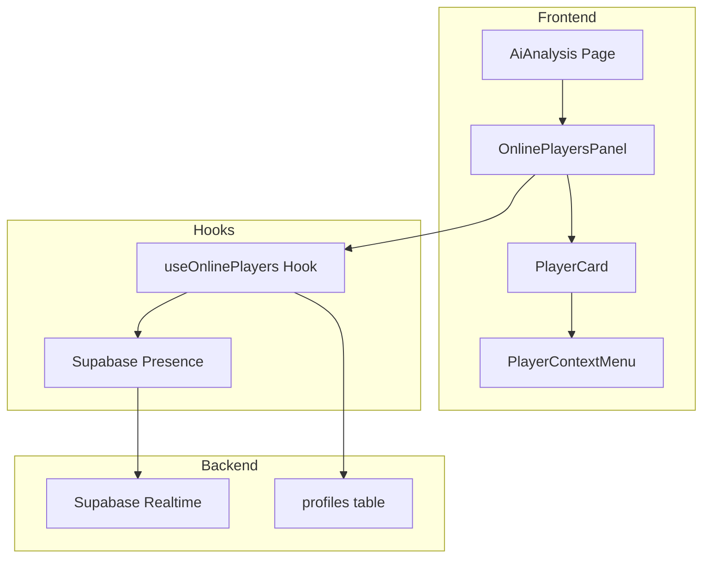

# Design Document: Replay Online List

## Overview

Tính năng hiển thị danh sách người chơi đang online trong trang AI Analysis (chế độ xem lại diễn biến ván cờ). Component sẽ được tích hợp vào sidebar hoặc panel riêng, sử dụng Supabase Presence để theo dõi trạng thái online real-time.

## Architecture



## Components and Interfaces

### 1. OnlinePlayersPanel Component

```typescript
interface OnlinePlayersPanelProps {
  currentUserId: string | null
  onChallenge?: (playerId: string) => void
  onMessage?: (playerId: string) => void
  onViewProfile?: (playerId: string) => void
}

interface OnlinePlayer {
  id: string
  username: string
  display_name?: string
  avatar_url?: string
  rank: string
  mindpoint: number
  is_friend: boolean
  last_active: string
}
```

### 2. useOnlinePlayers Hook

```typescript
interface UseOnlinePlayersOptions {
  userId: string | null
  friendsOnly?: boolean
  rankFilter?: string | null
  searchQuery?: string
}

interface UseOnlinePlayersReturn {
  players: OnlinePlayer[]
  totalCount: number
  countByRank: Record<string, number>
  loading: boolean
  error: Error | null
  refresh: () => void
}
```

### 3. PlayerContextMenu Component

```typescript
interface PlayerContextMenuProps {
  player: OnlinePlayer
  position: { x: number; y: number }
  onClose: () => void
  onChallenge: () => void
  onMessage: () => void
  onViewProfile: () => void
}
```

## Data Models

### OnlinePlayer

| Field | Type | Description |
|-------|------|-------------|
| id | string | User UUID |
| username | string | Unique username |
| display_name | string? | Display name |
| avatar_url | string? | Avatar image URL |
| rank | string | Current rank (vo_danh, tan_ky, etc.) |
| mindpoint | number | Current mindpoint score |
| is_friend | boolean | Whether user is a friend |
| last_active | string | ISO timestamp of last activity |

### Presence Payload

```typescript
interface PresencePayload {
  user_id: string
  online_at: string
  page: string // 'ai-analysis', 'home', etc.
}
```

## Correctness Properties

*A property is a characteristic or behavior that should hold true across all valid executions of a system-essentially, a formal statement about what the system should do. Properties serve as the bridge between human-readable specifications and machine-verifiable correctness guarantees.*

### Property 1: Online list real-time consistency
*For any* sequence of presence join/leave events, the displayed online list should accurately reflect the current set of online users within the specified time window.
**Validates: Requirements 1.2, 4.2**

### Property 2: Player display completeness
*For any* online player in the list, the rendered output should contain the player's avatar (or placeholder), username, and rank badge.
**Validates: Requirements 1.3**

### Property 3: Search filter correctness
*For any* search query string and list of online players, the filtered result should contain only players whose username contains the query (case-insensitive).
**Validates: Requirements 3.1**

### Property 4: Rank filter correctness
*For any* selected rank filter and list of online players, all players in the filtered result should have the selected rank.
**Validates: Requirements 3.2**

### Property 5: Friends filter correctness
*For any* user's friends list and online players list, when "Friends Only" is enabled, the result should be exactly the intersection of online players and friends.
**Validates: Requirements 3.3**

### Property 6: Online count accuracy
*For any* list of online players, the displayed total count should equal the length of the unfiltered online players list.
**Validates: Requirements 4.1**

## Error Handling

| Error Case | Handling Strategy |
|------------|-------------------|
| Presence connection failed | Show offline indicator, retry with exponential backoff |
| Profile fetch failed | Show player with placeholder data, retry on next sync |
| User not authenticated | Hide panel completely, show login prompt if clicked |
| Network timeout | Show cached data with "updating..." indicator |

## Testing Strategy

### Unit Tests
- Test filter functions (search, rank, friends) with various inputs
- Test presence event handlers for join/leave
- Test component rendering with different player counts

### Property-Based Tests
Using Hypothesis (Python) or fast-check (TypeScript):

1. **Property 1**: Generate random sequences of join/leave events, verify list consistency
2. **Property 3**: Generate random search queries and player lists, verify filter correctness
3. **Property 4**: Generate random rank selections and player lists, verify filter correctness
4. **Property 5**: Generate random friends lists and online lists, verify intersection
5. **Property 6**: Generate random player lists, verify count matches length

### Integration Tests
- Test Supabase Presence subscription lifecycle
- Test real-time updates across multiple browser tabs
- Test challenge/message actions trigger correct API calls
