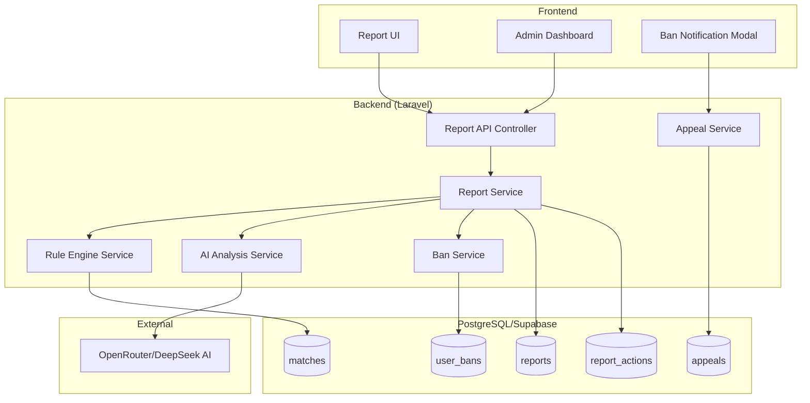

# Design Document - Hệ thống Báo cáo Vi phạm / Gian lận

## Overview

Hệ thống báo cáo vi phạm cho phép người chơi báo cáo các hành vi gian lận, toxic, bug trong game Cờ Caro online. Hệ thống sử dụng kết hợp Rule-based Detection và AI Analysis để tự động phát hiện và xử lý gian lận, đồng thời cung cấp giao diện admin để quản lý các báo cáo và khiếu nại.

## Architecture



## Components and Interfaces

### 1. Report API Controller

```php
// app/Http/Controllers/ReportController.php
class ReportController extends Controller
{
    public function store(CreateReportRequest $request): JsonResponse;
    public function index(GetReportsRequest $request): JsonResponse;  // Admin
    public function show(string $id): JsonResponse;  // Admin
    public function update(string $id, UpdateReportRequest $request): JsonResponse;  // Admin
}
```

### 2. Report Service

```php
// app/Services/ReportService.php
interface ReportServiceInterface
{
    public function createReport(array $data, string $reporterId): Report;
    public function processCheatReport(string $reportId): void;
    public function getReports(array $filters): LengthAwarePaginator;
    public function getReportDetail(string $reportId): Report;
    public function updateReport(string $reportId, array $data, string $adminId): Report;
}
```

### 3. Rule Engine Service

```php
// app/Services/RuleEngineService.php
interface RuleEngineServiceInterface
{
    public function analyzeMatch(string $matchId): RuleAnalysisResult;
    public function checkMultipleMoves(array $moves): array;
    public function checkImpossibleWins(array $boardState): array;
    public function checkTimingAnomalies(array $moves): array;
    public function generateReasonResult(array $violations): string;
}
```

### 4. AI Analysis Service

```php
// app/Services/AIAnalysisService.php
interface AIAnalysisServiceInterface
{
    public function analyzeCheatReport(array $information, string $reasonResult): ?AIAnalysisResult;
    public function buildPrompt(array $information, string $reasonResult): string;
    public function validateResponse(array $response): bool;
}
```

### 5. Ban Service

```php
// app/Services/BanService.php
interface BanServiceInterface
{
    public function applyBan(string $userId, string $reportId, string $banType, string $reason, ?int $durationDays): UserBan;
    public function liftBan(string $banId, string $adminId, string $reason): void;
    public function checkUserBanStatus(string $userId): UserBanStatus;
}
```

### 6. Appeal Service

```php
// app/Services/AppealService.php
interface AppealServiceInterface
{
    public function createAppeal(string $reportId, string $userId, string $reason): Appeal;
    public function processAppeal(string $appealId, string $status, string $adminResponse, string $adminId): Appeal;
}
```

## Data Models

### Report Model

```php
class Report extends Model
{
    protected $fillable = [
        'reporter_id',
        'reported_user_id', 
        'match_id',
        'type',           // 'gian_lan_trong_tran', 'toxic', 'bug', 'khac'
        'description',
        'status',         // 'pending', 'auto_flagged', 'resolved', 'dismissed', 'escalated'
        'rule_analysis',  // JSON
        'reason_result',
        'ai_analysis',    // JSON
        'ai_summary_player',
        'ai_details_admin',
        'processed_at',
        'processed_by',
        'admin_notes'
    ];
    
    protected $casts = [
        'rule_analysis' => 'array',
        'ai_analysis' => 'array',
        'processed_at' => 'datetime'
    ];
}
```

### Appeal Model

```php
class Appeal extends Model
{
    protected $fillable = [
        'report_id',
        'user_id',
        'reason',
        'status',         // 'pending', 'approved', 'rejected'
        'admin_response',
        'processed_by',
        'processed_at'
    ];
}
```

### UserBan Model

```php
class UserBan extends Model
{
    protected $fillable = [
        'user_id',
        'report_id',
        'ban_type',       // 'temporary', 'permanent', 'warning'
        'reason',
        'expires_at',
        'is_active',
        'lifted_at',
        'lifted_by',
        'lift_reason'
    ];
}
```

### RuleAnalysisResult DTO

```php
class RuleAnalysisResult
{
    public bool $hasViolations;
    public array $violations;
    public string $confidence;  // 'low', 'medium', 'high'
    public string $reasonResult;
    public array $metadata;
}
```

### AIAnalysisResult DTO

```php
class AIAnalysisResult
{
    public string $reportResult;  // 'co' | 'khong'
    public string $summaryForPlayer;
    public string $detailsForAdmin;
}
```

## Correctness Properties

*A property is a characteristic or behavior that should hold true across all valid executions of a system-essentially, a formal statement about what the system should do. Properties serve as the bridge between human-readable specifications and machine-verifiable correctness guarantees.*

### Property 1: Report Creation Data Integrity
*For any* valid report submission, the created report SHALL contain all required fields (reporter_id, type, status) and the status SHALL always be "pending".
**Validates: Requirements 2.1, 2.2**

### Property 2: Match ID Auto-attachment
*For any* report submitted from a match context, the match_id SHALL be automatically attached to the report record.
**Validates: Requirements 1.2**

### Property 3: Description Length Validation
*For any* report with description, the description length SHALL NOT exceed 1000 characters.
**Validates: Requirements 1.3**

### Property 4: Status Update Timestamp
*For any* report status change, the updated_at timestamp SHALL be greater than the previous updated_at value.
**Validates: Requirements 2.3**

### Property 5: Report Filter Consistency
*For any* report query with status filter, all returned reports SHALL have the specified status.
**Validates: Requirements 2.4**

### Property 6: Match ID Validation
*For any* report with match_id, the match_id SHALL reference an existing match in the database.
**Validates: Requirements 2.5**

### Property 7: Multiple Moves Detection
*For any* match move sequence where a player has consecutive moves without opponent's move in between, the rule engine SHALL detect and flag this as a violation.
**Validates: Requirements 3.2**

### Property 8: Impossible Win Detection
*For any* board state where both players have winning conditions (5 in a row), the rule engine SHALL detect and flag this as impossible.
**Validates: Requirements 3.3**

### Property 9: Timing Anomaly Detection
*For any* move sequence with timestamps, if consecutive moves have time difference less than 100ms or greater than configured timeout, the rule engine SHALL flag as anomaly.
**Validates: Requirements 3.4**

### Property 10: AI Response Validation
*For any* AI response, the system SHALL validate that it contains required fields (report_result, summary_for_player, details_for_admin) with correct types.
**Validates: Requirements 4.3**

### Property 11: Decision Logic - Auto Flag
*For any* report where rule-based detects violations AND AI returns "co", the final status SHALL be "auto_flagged".
**Validates: Requirements 5.1**

### Property 12: Decision Logic - Escalate
*For any* report where rule-based has suspicion BUT AI returns "khong", the final status SHALL be "escalated".
**Validates: Requirements 5.2**

### Property 13: Decision Logic - Dismiss
*For any* report where rule-based finds nothing AND AI returns "khong", the final status SHALL be "dismissed".
**Validates: Requirements 5.3**

### Property 14: Ban Application
*For any* auto_flagged report, a corresponding ban record SHALL be created with the configured penalty type.
**Validates: Requirements 6.1**

### Property 15: Appeal Creation
*For any* appeal submission, the appeal SHALL be linked to the original report_id and SHALL NOT trigger AI processing.
**Validates: Requirements 7.1, 7.2**

### Property 16: Appeal Queue
*For any* created appeal, the associated report status SHALL be updated to include appeal in admin review queue.
**Validates: Requirements 7.3**

## Error Handling

### API Error Responses

```php
// Standard error response format
{
    "success": false,
    "error": {
        "code": "VALIDATION_ERROR",
        "message": "Mô tả chi tiết lỗi",
        "details": {}
    }
}
```

### Error Codes

| Code | Description |
|------|-------------|
| VALIDATION_ERROR | Input validation failed |
| REPORT_NOT_FOUND | Report ID không tồn tại |
| MATCH_NOT_FOUND | Match ID không tồn tại |
| UNAUTHORIZED | Không có quyền truy cập |
| AI_SERVICE_ERROR | Lỗi khi gọi AI service |
| AI_TIMEOUT | AI service timeout (>30s) |
| ALREADY_REPORTED | Đã báo cáo trận này rồi |
| BAN_NOT_FOUND | Ban record không tồn tại |
| APPEAL_EXISTS | Đã có khiếu nại cho report này |

### Graceful Degradation

1. **AI Service Unavailable**: Chuyển report sang "escalated" để admin xử lý thủ công
2. **Database Connection Error**: Retry 3 lần với exponential backoff
3. **Rate Limiting**: Trả về 429 với thông báo thời gian chờ

## Testing Strategy

### Unit Testing Framework
- **PHP**: PHPUnit với Laravel testing utilities
- **TypeScript**: Jest cho frontend components

### Property-Based Testing Framework
- **PHP**: Eris (PHP property-based testing library)
- **Configuration**: Minimum 100 iterations per property test

### Test Categories

#### 1. Unit Tests
- Report creation validation
- Rule engine individual checks
- AI response parsing
- Ban status calculation

#### 2. Property-Based Tests
- Report data integrity properties
- Rule engine detection properties
- Decision logic properties
- Filter consistency properties

#### 3. Integration Tests
- Full report submission flow
- AI integration with mocked responses
- Admin workflow tests

### Test Annotation Format
```php
/**
 * **Feature: report-violation-system, Property 7: Multiple Moves Detection**
 * @test
 */
public function it_detects_multiple_moves_in_single_turn(): void
```

## Configuration

### Environment Variables

```env
# AI Service
AI_API_URL=https://openrouter.ai/api/v1/chat/completions
AI_API_KEY=your_api_key
AI_MODEL=deepseek/deepseek-chat
AI_TIMEOUT_SECONDS=30

# Ban Configuration
AUTO_BAN_ENABLED=true
DEFAULT_BAN_TYPE=temporary
DEFAULT_BAN_DURATION_DAYS=7

# Rate Limiting
REPORT_RATE_LIMIT_PER_HOUR=5
REPORT_RATE_LIMIT_PER_DAY=20

# Rule Engine
TIMING_ANOMALY_MIN_MS=100
TIMING_ANOMALY_MAX_MS=300000
```

## Security Considerations

1. **Authentication**: Tất cả API endpoints yêu cầu authentication
2. **Authorization**: Admin endpoints yêu cầu admin role
3. **Rate Limiting**: Giới hạn số report per user per hour/day
4. **Input Validation**: Sanitize tất cả user input
5. **Audit Trail**: Log tất cả admin actions
