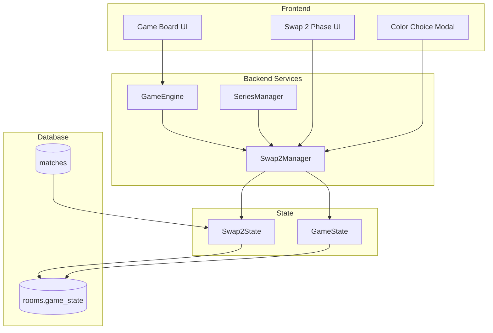
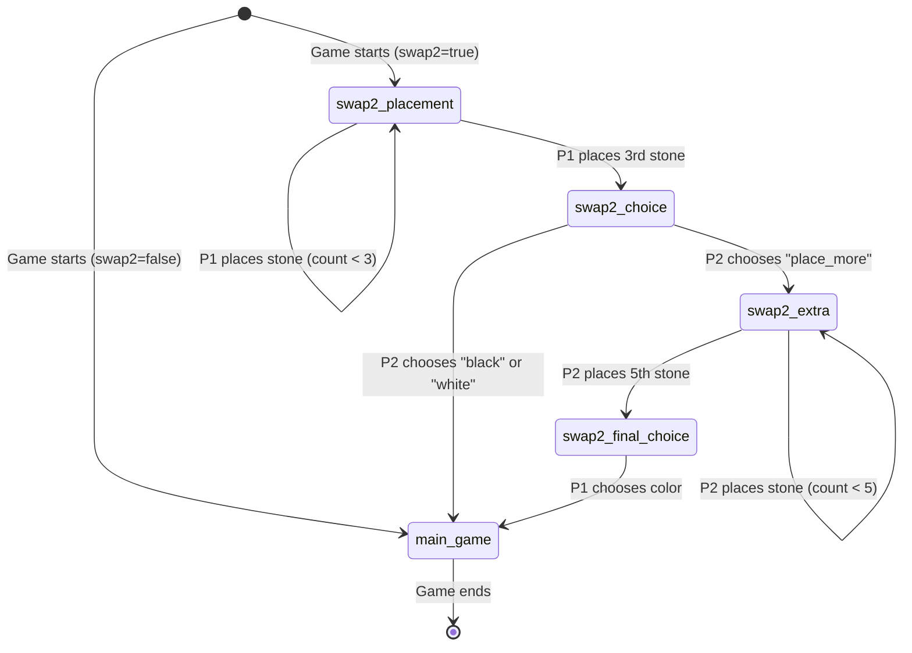

# Design Document - Swap 2 Opening Rule

## Overview

Swap 2 Opening Rule là cơ chế cân bằng lợi thế đi trước trong Gomoku/Caro. Hệ thống này được tích hợp vào GameEngine hiện tại như một phase bổ sung trước main game, không thay đổi logic game chính.

**Luồng Swap 2:**
```
swap2_placement (P1 đặt 3 quân)
    ↓
swap2_choice (P2 chọn: black/white/place_more)
    ↓
[Nếu place_more] → swap2_extra (P2 đặt 2 quân) → swap2_final_choice (P1 chọn màu)
    ↓
main_game (Chơi bình thường, Black đi trước)
```

## Architecture



## Components and Interfaces

### 1. Swap2Manager (New Service)

```typescript
interface Swap2Manager {
  // Initialize Swap 2 for a new game
  initializeSwap2(gameId: string, player1Id: string, player2Id: string): Swap2State
  
  // Place a stone during Swap 2 phases
  placeStone(gameId: string, playerId: string, x: number, y: number): Swap2State
  
  // Make color choice
  makeChoice(gameId: string, playerId: string, choice: Swap2Choice): Swap2State
  
  // Get current Swap 2 state
  getState(gameId: string): Swap2State | null
  
  // Check if Swap 2 is complete
  isComplete(state: Swap2State): boolean
  
  // Get final color assignments
  getFinalAssignments(state: Swap2State): ColorAssignment
}

type Swap2Phase = 
  | 'swap2_placement'    // P1 places 3 stones
  | 'swap2_choice'       // P2 chooses
  | 'swap2_extra'        // P2 places 2 more (if chose place_more)
  | 'swap2_final_choice' // P1 chooses color
  | 'complete'           // Swap 2 done, ready for main game

type Swap2Choice = 'black' | 'white' | 'place_more'
```

### 2. Extended GameState

```typescript
interface GameState {
  // Existing fields
  board: (string | null)[][]
  moves: Move[]
  currentTurn: 'X' | 'O'
  // ... other existing fields
  
  // New Swap 2 fields
  swap2Enabled: boolean
  swap2State?: Swap2State
  gamePhase: 'swap2' | 'main_game'
}

interface Swap2State {
  phase: Swap2Phase
  player1Id: string
  player2Id: string
  activePlayerId: string  // Who should act now
  
  // Stones placed during Swap 2 (positions only, colors assigned later)
  tentativeStones: TentativeStone[]
  
  // After choice is made
  finalChoice?: {
    chooser: string      // Who made the final choice
    chosenColor: 'black' | 'white'
  }
  
  // Final assignments
  blackPlayerId?: string
  whitePlayerId?: string
  
  // History for replay
  actions: Swap2Action[]
}

interface TentativeStone {
  x: number
  y: number
  placedBy: string       // Player who placed it
  placementOrder: number // 1-5
  phase: Swap2Phase      // Which phase it was placed in
}

interface Swap2Action {
  type: 'place' | 'choice'
  playerId: string
  timestamp: string
  data: {
    x?: number
    y?: number
    choice?: Swap2Choice
  }
}

interface ColorAssignment {
  blackPlayerId: string
  whitePlayerId: string
  firstMover: string  // Always black player
}
```

### 3. Room Configuration Extension

```typescript
interface RoomConfig {
  // Existing fields
  mode: 'ranked' | 'tieu_dao' | 'van_mon' | 'di_bien_ky' | 'custom'
  // ... other fields
  
  // New Swap 2 config
  swap2Enabled: boolean  // Auto-true for ranked, configurable for others
}
```

### 4. Frontend Components

```typescript
// Swap 2 Phase Indicator
interface Swap2PhaseIndicatorProps {
  phase: Swap2Phase
  activePlayer: Player
  stonesPlaced: number
  stonesRequired: number
}

// Color Choice Modal
interface ColorChoiceModalProps {
  phase: 'swap2_choice' | 'swap2_final_choice'
  options: Swap2Choice[]
  onChoice: (choice: Swap2Choice) => void
  tentativeStones: TentativeStone[]
  timeRemaining: number
}

// Tentative Stone Display
interface TentativeStoneProps {
  stone: TentativeStone
  isLatest: boolean
}
```

## Data Models

### Database Schema Changes

```sql
-- Add swap2 config to rooms
ALTER TABLE rooms ADD COLUMN swap2_enabled boolean DEFAULT false;

-- Add swap2 state to game_state JSON
-- game_state.swap2State will contain Swap2State object

-- Add swap2 history to matches
ALTER TABLE matches ADD COLUMN swap2_history jsonb;
-- Contains: { actions: Swap2Action[], finalAssignment: ColorAssignment }
```

### State Machine



## Correctness Properties

*A property is a characteristic or behavior that should hold true across all valid executions of a system-essentially, a formal statement about what the system should do. Properties serve as the bridge between human-readable specifications and machine-verifiable correctness guarantees.*

### Property 1: Initial Phase Correctness
*For any* game with swap2Enabled=true, the initial gamePhase SHALL be "swap2" and swap2State.phase SHALL be "swap2_placement" with player1 as activePlayer.
**Validates: Requirements 1.1**

### Property 2: State Machine Transition Correctness
*For any* valid Swap 2 action sequence, the phase transitions SHALL follow the defined state machine: placement(3) → choice → [extra(2) → final_choice] → complete.
**Validates: Requirements 1.2, 1.3, 1.5, 1.6**

### Property 3: Stone Count Invariant
*For any* Swap 2 state, the number of tentativeStones SHALL equal:
- 0-3 in swap2_placement phase
- 3 in swap2_choice phase  
- 3-5 in swap2_extra phase
- 5 in swap2_final_choice phase (if reached)
**Validates: Requirements 2.1, 2.2, 2.3**

### Property 4: Occupied Cell Rejection
*For any* stone placement attempt on a cell that already has a tentativeStone, the Swap2Manager SHALL reject the move and state SHALL remain unchanged.
**Validates: Requirements 2.4**

### Property 5: Color Assignment Correctness
*For any* completed Swap 2 sequence where a player chooses "black", that player SHALL be assigned blackPlayerId, and the other player SHALL be assigned whitePlayerId. Vice versa for "white" choice.
**Validates: Requirements 3.2, 3.3**

### Property 6: Available Options Correctness
*For any* swap2_choice phase, exactly 3 options SHALL be available: ["black", "white", "place_more"]. *For any* swap2_final_choice phase, exactly 2 options SHALL be available: ["black", "white"].
**Validates: Requirements 3.1, 3.5**

### Property 7: Next Mover Determination
*For any* completed Swap 2 sequence, the player assigned blackPlayerId SHALL be the first to move in main_game phase (currentTurn corresponds to black player).
**Validates: Requirements 3.6**

### Property 8: Ranked Mode Enforcement
*For any* game created with mode="ranked", swap2Enabled SHALL be true and cannot be changed.
**Validates: Requirements 4.1**

### Property 9: Disabled Swap 2 Behavior
*For any* game with swap2Enabled=false, the initial gamePhase SHALL be "main_game" with currentTurn="X" and no swap2State.
**Validates: Requirements 4.3**

### Property 10: Series Swap 2 Reset
*For any* new game in a ranked series, the game SHALL start with fresh swap2_placement phase regardless of previous game's color assignments.
**Validates: Requirements 6.3**

### Property 11: State Persistence Round-Trip
*For any* Swap 2 state, serializing to JSON and deserializing SHALL produce an equivalent state with same phase, tentativeStones, and activePlayerId.
**Validates: Requirements 7.1, 7.2**

### Property 12: Invalid Action Rejection
*For any* action that doesn't match current phase requirements (wrong player, wrong action type, invalid position), the Swap2Manager SHALL reject and return error without state change.
**Validates: Requirements 8.1, 8.2, 8.3**

### Property 13: Active Player Correctness
*For any* Swap 2 phase, activePlayerId SHALL be:
- player1Id in swap2_placement and swap2_final_choice
- player2Id in swap2_choice and swap2_extra
**Validates: Requirements 1.1, 1.2, 1.4, 1.5**

### Property 14: Swap 2 History Completeness
*For any* completed Swap 2 sequence, the actions array SHALL contain exactly the sequence of placements and choices made, in order.
**Validates: Requirements 6.4, 7.3**

## Error Handling

### Invalid Actions
- Wrong player acts: Return error with correct activePlayerId
- Invalid position: Return error with reason (out of bounds, occupied)
- Invalid choice: Return error with valid options list
- Action in wrong phase: Return error with current phase info

### Timeout Handling
- Swap 2 phases have same timeout as regular moves (configurable, default 60s)
- On timeout during placement: Auto-place at random valid position
- On timeout during choice: Auto-select "black" (conservative default)

### State Recovery
- All Swap 2 state stored in game_state JSON
- On reconnect: Restore exact phase and tentativeStones
- On corruption: Log error, reset to swap2_placement with existing stones preserved if possible

### Edge Cases
- Player disconnects after placing 2/3 stones: Wait for reconnect or timeout
- Both players disconnect: Pause game, first to reconnect continues
- Server restart: Recover from database state

## Testing Strategy

### Property-Based Testing
- Use Hypothesis (Python) for backend Swap2Manager tests
- Use fast-check (TypeScript) for frontend state logic tests
- Minimum 100 iterations per property test

### Unit Tests
- Swap2Manager: initializeSwap2, placeStone, makeChoice
- State transitions for each phase
- Color assignment logic
- Validation functions

### Integration Tests
- Full Swap 2 flow: placement → choice → main_game
- Full Swap 2 flow with place_more: placement → choice → extra → final_choice → main_game
- Series integration: multiple games with Swap 2
- Reconnection during Swap 2

### Test Annotations
Each property-based test MUST include:
```python
# **Feature: swap2-opening-rule, Property N: [property description]**
# **Validates: Requirements X.Y**
```
