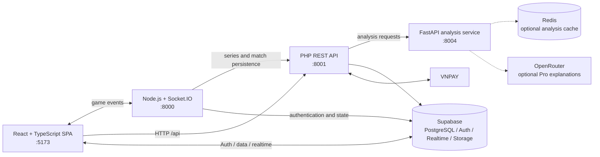

# MindPoint Arena

<p align="right"><strong>English</strong> · <a href="README.vi.md">Tiếng Việt</a></p>

**A full-stack online Gomoku platform that combines competitive play, real-time multiplayer, game variants, and explainable post-match analysis.**

[](frontend/package.json)
[](frontend/package.json)
[](backend/composer.json)
[](ai/main.py)
[](server/index.js)

MindPoint Arena evolves the traditional five-in-a-row game into a service-oriented platform. Players can compete in ranked best-of-three series, open private or casual rooms, practise against AI, explore rule variants, and review completed matches through a dedicated analysis and what-if replay service.

> The repository is an engineering project under active development. Local setup requires Supabase and four application processes; there is currently no hosted demo or Docker Compose bundle.

## Visual showcase

<p align="center">
  
</p>

<p align="center">
  
</p>
<p align="center"><em>Animated loading sequence used to establish the arena's visual identity.</em></p>

## What is implemented

- **Competitive Gomoku** — 15×15 play, five-in-a-row validation, ranked best-of-three series, MindPoint progression, side rotation, forfeits, rematches, and a 10-second ranked disconnect grace period.
- **Swap2 opening** — server-side placement and colour-choice phases, mandatory in ranked play and configurable in supported casual/variant flows.
- **Real-time multiplayer** — mode-specific queues, rooms, moves, series transitions, reconnect handling, notifications, and variant synchronization over Socket.IO.
- **Four variant engines** — configurable rules, hidden pieces, mana-based skills, and terrain tiles with special effects.
- **AI-assisted improvement** — rule-based analysis, threat/pattern evaluation, opening and endgame modules, VCF/VCT search, optional OpenRouter explanations, interactive replay, and move suggestions.
- **Platform systems** — Supabase authentication and persistence, profiles, friends, chat, reports/appeals/bans, inbox notifications, tournaments, titles, inventory, skill packages, subscriptions, and VNPAY payment flows.
- **Internationalized UI** — Vietnamese, English, Chinese, and Japanese resources through i18next.

### Repository snapshot

The following numbers are derived from the current source tree and are intended as codebase orientation, not performance claims:

| Area | Current source evidence |
|---|---:|
| Application services | 4 |
| PHP feature route definitions | 69 |
| FastAPI endpoints | 21 |
| Named Socket.IO event types | 52 (19 inbound, 33 outbound) |
| Canonical Supabase schema tables | 46 |
| SQL migration files | 74 |
| Automated test files | 86 (3 frontend, 28 PHP, 55 Python) |

## Architecture



| Service | Responsibility | Default port |
|---|---|---:|
| `frontend/` | React/Vite SPA, game boards, account and platform UI | `5173` |
| `server/` | Socket.IO rooms, queues, live game state, Swap2 and disconnect events | `8000` |
| `backend/` | PHP REST API, domain services, payments, moderation and persistence bridges | `8001` |
| `ai/` | FastAPI match analysis, replay simulation, caching and move suggestions | `8004` |

The browser uses the PHP API for request/response workflows and the Socket.IO server for live matches. Ranked matchmaking asks the PHP API to create and update a best-of-three series. Supabase provides authentication and persistent data, while the AI service can operate with deterministic analysis and optionally enrich selected responses through OpenRouter.

## Game modes and real-time flow

### Core modes

| Mode | Behaviour | Opening rule |
|---|---|---|
| Ranked | Authenticated online queue, best-of-three series, MindPoint updates | Swap2 required |
| Casual / private room | Unranked online play or invited-room flow | Optional where supported |
| AI training | Three configured difficulty levels: Beginner, Expert, Master | Disabled by default; can be enabled for practice |
| Hotseat | Two players on one device | Configurable local flow |
| Tournament | Tournament UI and Supabase-backed tournament data model | Depends on room configuration |

### Variant modes

| Variant | Main rule change | Matchmaking configuration |
|---|---|---|
| Custom | Configurable board size, win length, timer and Swap2 | 15×15, five-in-a-row, 30-second turns, Swap2 on |
| Hidden | Opponent pieces can remain hidden until revealed by adjacency | 15×15, five-in-a-row, 30-second turns, Swap2 on |
| Skill | Mana, cooldowns and a database-backed pool of 60 tactical skills | 15×15, five-in-a-row, 30-second turns |
| Terrain | Special tiles such as bomb, freeze, teleport, shield and score effects | 15×15, five-in-a-row, 30-second turns |

The current Socket.IO matcher uses **in-memory FIFO queues partitioned by core mode or variant type**. Ranked users must authenticate; a successful match creates a series through the PHP API. This is intentionally documented as FIFO—the current server accepts MindPoint metadata but does not yet use it to rank candidates.

Representative real-time flows include:

```text
join_queue → queue_waiting | queue_matched
swap2_place_stone → swap2_stone_placed → swap2_make_choice → swap2_complete
move → move_made → match_end → series_next_game_preparing
disconnecting → opponent_disconnected → disconnect_countdown → reconnect | forfeit
join_variant_queue → variant_match_found → variant_move → variant_game_over
```

See [`server/index.js`](server/index.js) for the authoritative event handlers. Older protocol notes in `docs/` may not contain every current event.

## AI analysis

The analysis service separates deterministic game logic from optional LLM-generated explanations:

- **Basic analysis** evaluates positions, threats, patterns, mistakes, tempo, openings, and endgames locally.
- **Advanced analysis** includes alternative-line search, threat-space analysis, transposition tables, VCF/VCT detection, player-role evaluation, and Numba-accelerated paths where available.
- **Pro explanations** can call OpenRouter when `OPENROUTER_API_KEY` is configured; deterministic fallbacks remain available without it.
- **Replay / what-if mode** reconstructs a match at a selected move, accepts an alternative move, generates a response, supports undo, and compares the resulting position.
- **Caching** supports in-process analysis caching and an optional Redis backend.

Useful endpoints include `POST /api/v2/analyze`, `POST /ask`, `POST /replay/create`, `POST /replay/play`, `POST /suggest_move`, and `GET /health`. FastAPI exposes interactive API documentation at `http://localhost:8004/docs` while the service is running.

## Technology stack

| Layer | Main technologies |
|---|---|
| Web application | React 18, TypeScript, Vite, i18next, Recharts |
| Real-time gateway | Node.js, Express, Socket.IO |
| Application API | PHP, PSR-4 services, PHPUnit, Eris |
| Analysis engine | Python, FastAPI, NumPy, Numba, Hypothesis, pytest |
| Data platform | Supabase Auth, PostgreSQL, Row Level Security, Realtime, Storage |
| Optional integrations | Redis, OpenRouter, VNPAY, ngrok for local callbacks |

## Quick start

### Prerequisites

- Node.js 18+ and npm
- PHP 8.1+ and Composer
- Python 3.10+ and pip
- A Supabase project
- Redis only if testing the distributed analysis cache
- ngrok only if an external payment callback must reach a local machine

### 1. Install dependencies

```bash
git clone https://github.com/VNDT1625/Caro.git
cd Caro

cd frontend && npm ci && cd ..
cd server && npm ci && cd ..
cd backend && composer install && cd ..

cd ai
python -m venv .venv
# Windows PowerShell: .\.venv\Scripts\Activate.ps1
# macOS/Linux:      source .venv/bin/activate
pip install -r requirements.txt
cd ..
```

### 2. Configure the services

Start from the supplied frontend/backend examples and keep secrets outside version control:

```bash
# Windows PowerShell
Copy-Item frontend/.env.example frontend/.env
Copy-Item backend/.env.supabase.example backend/.env

# macOS/Linux
# cp frontend/.env.example frontend/.env
# cp backend/.env.supabase.example backend/.env
```

Create `server/.env` with the following minimum configuration:

```dotenv
PORT=8000
SUPABASE_URL=https://your-project.supabase.co
SUPABASE_ANON_KEY=your-public-anon-key
SUPABASE_SERVICE_KEY=your-server-only-service-role-key
PHP_BACKEND_URL=http://localhost:8001
BACKEND_API_URL=http://localhost:8001
```

Configure the browser and PHP API with the matching URLs:

```dotenv
# frontend/.env
VITE_SUPABASE_URL=https://your-project.supabase.co
VITE_SUPABASE_ANON_KEY=your-public-anon-key
VITE_API_URL=http://localhost:8001
VITE_SOCKET_URL=http://localhost:8000

# backend/.env — add alongside the selected template
SUPABASE_URL=https://your-project.supabase.co
SUPABASE_ANON_KEY=your-public-anon-key
SUPABASE_SERVICE_KEY=your-server-only-service-role-key
AI_SERVICE_URL=http://localhost:8004
```

Optional integrations:

| Service | Variables |
|---|---|
| AI explanations | `OPENROUTER_API_KEY` in `ai/.env` |
| Redis cache | `REDIS_HOST`, `REDIS_PORT`, `REDIS_DB`, `REDIS_PASSWORD` |
| VNPAY | `VNPAY_TMN_CODE`, `VNPAY_HASH_SECRET`, `VNPAY_RETURN_URL`, `VNPAY_IPN_URL`, `VNPAY_GATEWAY_URL` |

Apply [`infra/supabase_schema.sql`](infra/supabase_schema.sql) to a new Supabase database or execute the versioned files in [`infra/migrations/`](infra/migrations/) in deployment order.

> `VITE_*` values are bundled into browser code. Never place a Supabase service-role key, VNPAY secret, or production LLM key in a frontend variable; route privileged operations through the backend.

### 3. Run the four processes

```bash
# Terminal 1 — PHP API
cd backend/public
php -S localhost:8001 router.php

# Terminal 2 — Socket.IO server
cd server
npm start

# Terminal 3 — analysis service
cd ai
uvicorn main:app --port 8004

# Terminal 4 — web application
cd frontend
npm run dev -- --host --port 5173
```

Open `http://localhost:5173`. Health-check the analysis service at `http://localhost:8004/health`.

## Testing

| Area | Command | Coverage focus |
|---|---|---|
| Frontend | `cd frontend && npm test -- --run` | API adapters, analysis state and winner detection |
| PHP backend | `cd backend && ./vendor/bin/phpunit --testdox` | Game engine, series, Swap2, skills, moderation, caching and service integration |
| AI service | `python -m pytest ai/tests -q` | Property-based game logic, VCF/VCT, replay, caching, regression and performance contracts |

The Python and PHP suites make extensive use of property-based tests through Hypothesis and Eris. The current GitHub Actions workflow runs the PHP suite; adding frontend, AI, Socket.IO integration, and build jobs is part of the release-hardening roadmap.

## Repository structure

```text
Caro/
├── frontend/          # React/Vite SPA, pages, components, hooks and API clients
├── server/            # Express/Socket.IO gateway and live game orchestration
├── backend/           # PHP REST entry point, controllers, services and PHPUnit tests
├── ai/                # FastAPI analysis/replay service and Python test suite
├── infra/             # Canonical Supabase schema and ordered SQL migrations
├── shared/            # Shared datasets/assets consumed across services
├── docs/              # Architecture, API, database and development notes
├── scripts/           # Operational and load-test utilities
└── .kiro/specs/       # Feature requirements and implementation design records
```

## Deployment notes

The repository currently uses manual multi-process orchestration and does not include Docker or Kubernetes manifests. A production deployment should treat each component independently:

- Build `frontend/` with `npm run build` and serve `frontend/dist/` from a static host.
- Serve `backend/public/` behind Nginx or Apache with PHP-FPM; do not expose application or environment files.
- Run `server/` as a long-lived WebSocket process behind a proxy configured for upgrade connections.
- Run `ai/` behind a production ASGI process manager and enable Redis when cache sharing is required.
- Restrict CORS to the deployed frontend, use HTTPS/WSS, rotate secrets, and configure Supabase RLS before accepting users.

Because queues and active rooms are currently held in Node.js memory, horizontal Socket.IO scaling requires a shared adapter/state design before multiple gateway replicas are introduced.

## Current limitations and roadmap

- Replace FIFO in-memory matchmaking with persistent queues and explicit rating/latency matching.
- Move active room and reconnect state to shared infrastructure for crash recovery and horizontal scaling.
- Add a reproducible Docker Compose development environment and production deployment templates.
- Expand CI beyond PHPUnit to include frontend build/tests, Python tests, Socket.IO integration tests, and schema checks.
- Consolidate legacy direct PHP routes and the feature route table into one generated API contract.
- Publish a hosted demo and verified performance/load-test report when deployment infrastructure is available.

## License and attribution

MindPoint Arena is maintained by the owner of the [`VNDT1625/Caro`](https://github.com/VNDT1625/Caro) repository. No root open-source license file is currently included, so reuse, redistribution, or derivative work is **not granted by default**. Add an explicit license before distributing the project as open source. Third-party dependencies remain subject to their respective licenses.
