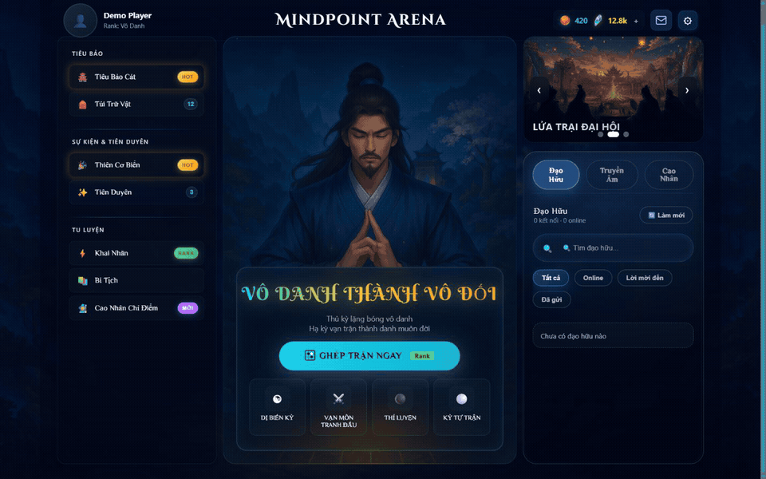
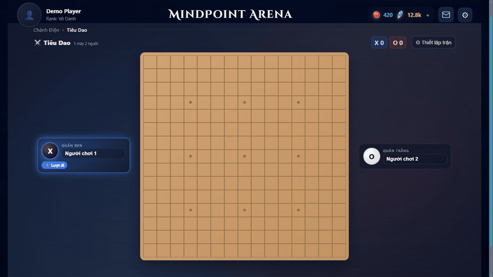
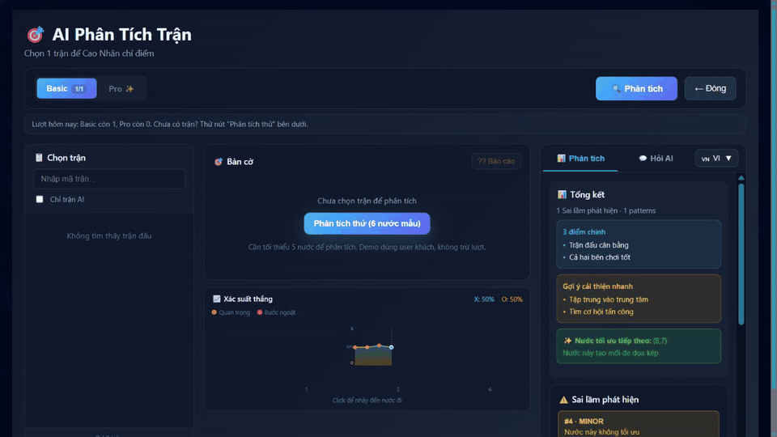
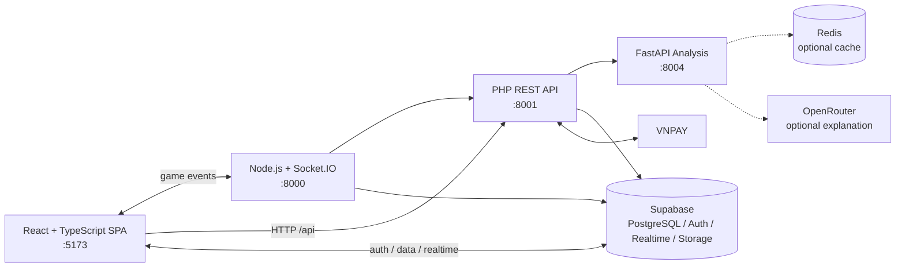

# MindPoint Arena

<p align="right"><a href="README.md">English</a> · <strong>Tiếng Việt</strong></p>

**Nền tảng Gomoku full-stack kết hợp thi đấu xếp hạng, multiplayer thời gian thực, game variant và phân tích sau trận có thể giải thích.**

MindPoint Arena mở rộng cờ năm quân thành một nền tảng dịch vụ hoàn chỉnh. Người chơi có thể thi đấu ranked best-of-three, tạo phòng private/casual, luyện tập với AI, chơi nhiều biến thể luật và xem lại trận đấu bằng hệ thống analysis/what-if replay riêng.

> Repository đang được phát triển. Local setup cần Supabase và bốn application process; hiện chưa có hosted demo hoặc Docker Compose bundle.

## Hình ảnh sản phẩm

<p align="center">
  
</p>
<p align="center"><em>Dashboard arena đúng tỉ lệ 16:9 với bộ ảnh sự kiện hoàn chỉnh.</em></p>

<p align="center">
  
</p>
<p align="center"><em>Luồng hot-seat 15×15 dùng game board và move logic của ứng dụng.</em></p>

<p align="center">
  
</p>
<p align="center"><em>Phân tích sau trận hiển thị sai lầm, pattern, insight và nước đi tiếp theo được đề xuất.</em></p>

> [!NOTE]
> Bản ghi sử dụng dữ liệu demo không nhạy cảm. Dashboard, tương tác bàn cờ và analysis UI được chụp từ ứng dụng đang chạy; bộ ảnh sự kiện mới nằm trong `frontend/public/`.

## Tính năng đã triển khai

- **Competitive Gomoku:** bàn 15×15, kiểm tra năm quân liên tiếp, ranked best-of-three, MindPoint progression, đổi bên, forfeit, rematch và ranked disconnect grace period 10 giây.
- **Swap2 opening:** placement và colour-choice phase xử lý phía server; bắt buộc trong ranked và có thể cấu hình ở một số casual/variant flow.
- **Real-time multiplayer:** queue theo mode, room, move, series transition, reconnect, notification và variant synchronization qua Socket.IO.
- **Bốn variant engine:** Custom, Hidden, Skill và Terrain.
- **AI analysis:** phân tích rule-based, threat/pattern evaluation, opening/endgame, VCF/VCT search, replay tương tác và gợi ý nước đi.
- **Platform systems:** Supabase Auth, profile, friend, chat, report/appeal/ban, notification, tournament, title, inventory, subscription và VNPAY.
- **Đa ngôn ngữ:** tài nguyên tiếng Việt, Anh, Trung và Nhật thông qua i18next.

## Quy mô snapshot

| Thành phần | Số liệu từ source hiện tại |
|---|---:|
| Application services | 4 |
| PHP feature route definitions | 69 |
| FastAPI endpoints | 21 |
| Socket.IO event types | 52 — 19 inbound, 33 outbound |
| Supabase schema tables | 46 |
| SQL migration files | 74 |
| Automated test files | 86 — 3 frontend, 28 PHP, 55 Python |

## Kiến trúc



| Service | Trách nhiệm | Port mặc định |
|---|---|---:|
| `frontend/` | React/Vite SPA, game board, account và platform UI | 5173 |
| `server/` | Socket.IO room, queue, game state, Swap2 và disconnect event | 8000 |
| `backend/` | PHP REST API, domain service, payment, moderation và persistence bridge | 8001 |
| `ai/` | FastAPI match analysis, replay simulation, cache và move suggestion | 8004 |

## Game mode và matchmaking

### Core mode

| Mode | Cách hoạt động | Opening rule |
|---|---|---|
| Ranked | Queue online, best-of-three, cập nhật MindPoint | Bắt buộc Swap2 |
| Casual/private | Trận unranked hoặc phòng mời | Tùy cấu hình |
| AI training | Beginner, Expert, Master | Mặc định tắt Swap2 |
| Hotseat | Hai người chơi trên cùng thiết bị | Local configuration |
| Tournament | UI và data model tournament trên Supabase | Theo cấu hình phòng |

### Variant mode

| Variant | Thay đổi chính |
|---|---|
| Custom | Board size, win length, timer và Swap2 có thể cấu hình |
| Hidden | Quân đối phương có thể bị ẩn đến khi được adjacency reveal |
| Skill | Mana, cooldown và pool 60 tactical skills từ database |
| Terrain | Tile đặc biệt: bomb, freeze, teleport, shield và score effect |

Matchmaker Socket.IO hiện dùng **FIFO queue trong memory**, chia theo core mode hoặc variant type. Ranked yêu cầu đăng nhập và tạo best-of-three series qua PHP API. MindPoint metadata được nhận nhưng chưa dùng để xếp hạng candidate.

```text
join_queue → queue_waiting | queue_matched
swap2_place_stone → swap2_stone_placed → swap2_make_choice → swap2_complete
move → move_made → match_end → series_next_game_preparing
disconnecting → opponent_disconnected → disconnect_countdown → reconnect | forfeit
join_variant_queue → variant_match_found → variant_move → variant_game_over
```

## AI analysis

- **Basic:** position, threat, pattern, mistake, tempo, opening và endgame.
- **Advanced:** alternative-line search, threat-space analysis, transposition table, VCF/VCT và Numba acceleration khi khả dụng.
- **Pro explanation:** gọi OpenRouter khi có `OPENROUTER_API_KEY`; deterministic fallback vẫn hoạt động khi không có key.
- **Replay/what-if:** dựng lại trận tại một move, thử nước thay thế, tạo response, undo và so sánh position.
- **Cache:** hỗ trợ in-process cache và Redis tùy chọn.

FastAPI cung cấp các endpoint như `POST /api/v2/analyze`, `POST /ask`, `POST /replay/create`, `POST /replay/play`, `POST /suggest_move` và `GET /health`.

## Công nghệ

| Lớp | Công nghệ |
|---|---|
| Frontend | React 18, TypeScript, Vite, i18next, Recharts |
| Realtime | Node.js, Express, Socket.IO |
| Application API | PHP, PSR-4, PHPUnit, Eris |
| Analysis | Python, FastAPI, NumPy, Numba, Hypothesis, pytest |
| Data | Supabase Auth, PostgreSQL, RLS, Realtime, Storage |
| Integration | Redis, OpenRouter, VNPAY, ngrok |

## Chạy local

Yêu cầu Node.js 18+, PHP 8.1+, Python 3.10+, Composer và một Supabase project.

```bash
git clone https://github.com/VNDT1625/Caro.git
cd Caro

cd frontend && npm ci && cd ..
cd server && npm ci && cd ..
cd backend && composer install && cd ..
cd ai && pip install -r requirements.txt && cd ..
```

Sau khi cấu hình các file `.env`, chạy bốn process:

```bash
# PHP API
cd backend/public && php -S localhost:8001 router.php

# Socket.IO
cd server && npm start

# AI service
cd ai && uvicorn main:app --port 8004

# Web
cd frontend && npm run dev -- --host --port 5173
```

Không đưa Supabase service-role key, VNPAY secret hoặc LLM key vào biến `VITE_*` vì chúng sẽ được bundle vào browser.

## Testing

```bash
cd frontend && npm test -- --run
cd backend && ./vendor/bin/phpunit --testdox
python -m pytest ai/tests -q
```

## Giới hạn và roadmap

- FIFO matchmaking chưa xếp cặp theo rating hoặc latency.
- Queue và active room nằm trong memory, chưa hỗ trợ horizontal scaling hoặc crash recovery đầy đủ.
- Chưa có Docker Compose và production deployment template tái lập.
- CI hiện chưa bao phủ đồng đều frontend, AI, Socket.IO integration và schema checks.
- Chưa có hosted demo hoặc performance report đã xác minh.

## License

Repository chưa có root open-source license. Quyền tái sử dụng hoặc phân phối không được cấp mặc định; dependency bên thứ ba tuân theo license riêng.
